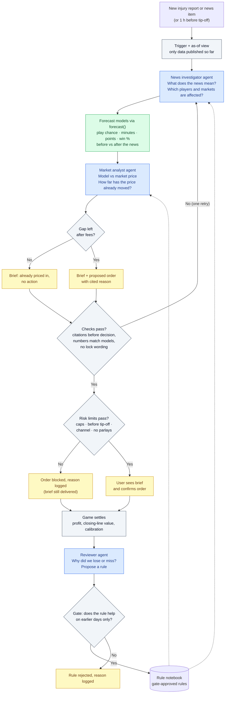
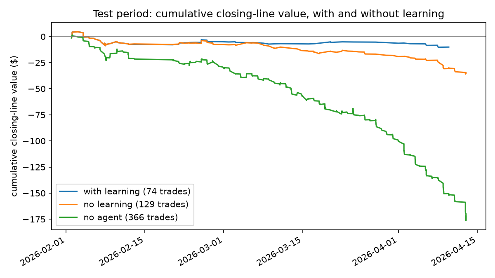

# Market-Graded Learning for NBA Game-Impact Intelligence

DASC7606C Group 12, Track 2 (Agentic Framework Design). A multi-channel agent
system that turns late game news and NBA statistics into cited impact briefs,
grades them against prediction-market prices, and can trade under
code-enforced guardrails tailored by user type.

**Deadline:** code, demo, backup recording and report by **Saturday 10 October 2026**.

> **Project status (5 Oct):** everything runs end to end on real data:
> ESPN box scores and inactive lists for three seasons, and Kalshi game-winner
> prices for 2025-26 (1,316 games). M1–M5 are trained (`forecast/`). The
> agent loop is market-anchored and learns gated notebook rules. Ablations,
> calibration and policy tests are in `evaluation/results/`, and the Streamlit
> demo is `app.py`. Results are summarised in [Results](#results). By default
> the agent runs with offline rules; add a Gemini key and `--llm` for the LLM
> steps.

## Contents

1. [Product and objectives](#1-product-and-objectives)
2. [System design](#2-system-design)
3. [Team, roles and work packages](#3-team-roles-and-work-packages)
4. [Schedule](#4-schedule)
5. [Handoffs between subgroups](#5-handoffs-between-subgroups)
6. [Data, models and evaluation](#6-data-models-and-evaluation)
7. [Demo script](#7-demo-script)
8. [Safety, risks and grading](#8-safety-risks-and-grading)
9. [How we work in this repo](#9-how-we-work-in-this-repo)

## 1. Product and objectives

Within minutes of a change that rewrites a night (injury or rest, minutes
restriction, role or lineup shift, trade, back-to-back, "trending toward
playing"), the system produces a cited brief and calibrated forecasts of
minutes, points and win probability. One forecast core serves several
channels. Channels differ in the risk they may take, not in whether they see
the forecast.

| Channel | Party | Need | What they get, and their risk exposure |
| --- | --- | --- | --- |
| Primary customer (pays) | Fantasy and sports-media platforms | Lock-time projection refresh they can audit | Distributions, win-probability change, cited brief, freshness fields |
| User (may license) | Broadcasters and writers | Deadline-safe "who gains, who loses" copy | Cited narrative; no stake or betting language |
| User (enterprise) | Team coaching and analytics | Opponent rotation and matchup odds | Internal brief only; no public market signal |
| End user | Retail bettors and prediction-market users | How late news moves probabilities; optional guarded trade | Model vs market view; per-order confirm, caps, cool-downs, no parlays, no "lock" copy |

**Objectives**

1. **Serve by channel:** one forecast core; channel-specific briefs and risk policies.
2. **Inform with uncertainty:** who gains or loses minutes and shots, and how win
   probability moves, with ranges and sources.
3. **Prove with markets:** replay 2025–26 day by day and grade forecasts against
   recorded Kalshi or Polymarket prices; report flat or negative results honestly.
4. **Learn safely:** keep only gate-approved rules; show the learning agent beats
   no-learning and no-agent baselines on held-out months.
5. **Demo one night across channels**, including a guarded fill, a reused learned
   rule, and planted failures that get rejected.

**Why an agent:** it chooses which stats to pull, which forecasts to recompute,
which brief and risk policy fit the channel, and which past rules apply.
**Why not ChatGPT:** no calibrated distributions, no channel risk limits, no
learning gate, no QA against settled outcomes. ChatGPT is still run as a
baseline on the same inputs.

## 2. System design

The trading agent is one LangGraph (`agents/graph.py`) with two phases.
**Decide** runs at every news item in the six hours before tip-off, and once
an hour before tip. **Review** runs after each replay day. Replay hands the
graph an as-of view: only news, finished games and quotes published by that
moment. Implemented in `agents/graph.py`, `agents/notebook.py`, `llm.py` and
`replay.py`.

Blue = LLM judgment; green = forecast numbers; grey = code; yellow = what the
user sees or what is logged. Dotted lines are gate-approved rules feeding the
next night's decisions.



| Diagram box | Graph node | Type | Job |
| --- | --- | --- | --- |
| News investigator (Forecaster in the work packages) | `investigate` | LLM | Read late news, apply notebook rules, name who is out and which markets are affected |
| Forecast models | `forecast` | Code / DL | `forecast/api.py` before vs after the news: play chance (M3), minutes and points (M2 GRU), win % (M4) |
| Market analyst (Grader / trader) | `analyse` → `propose` / `no_action` | LLM + code | Code computes the gap after fees; the LLM may drop a trade and explain, never add one |
| Checks | `checks` | Code | Citations must predate the decision; numbers must match the models; no “lock” wording; one retry then block |
| Risk limits | `risk` | Code | Caps, no post-tip orders, channel permissions; team and media cannot order; no parlays |
| Confirm / blocked | `confirm` / `blocked` → `deliver` | Code | Brief always delivered; replay auto-confirms; live demo waits on the user |
| Reviewer | `review` | LLM | After settlement, blame the loss or miss and propose a machine-checkable rule |
| Gate + notebook | `gate` → `save_rule` / `reject_rule` | Code | Back-test on earlier days only; only the gate sets a rule active |
| Replay and scorer | `replay.py` | Code | Decision times, fills at ask plus fees, P&L, closing-line value |

The agent that writes a rule never approves it. Risk limits are code, so an
agent cannot override them. All three agents call chat models through one
wrapper so a supplier (Gemini, OpenAI, Anthropic, DeepSeek) can be swapped
without changing agent code; every decision logs the supplier and model version.

A rule has a condition code can check and an action code can apply:

```json
{"when": {"team": "Y", "ruled_out_position": "C", "hours_to_tip_max": 2},
 "do": {"minutes_share": {"backup_C": 0.70, "others": 0.30}},
 "evidence": "helped on 14 of 18 past cases", "status": "active"}
```

Trader rules work the same way, for example "skip player-prop trades when the
news is older than 20 minutes" or "pause live size after three losing sessions".

`checks` rejects: leakage (inputs published after the decision), invalid
minutes, orders over channel limits, missing cited reason, retail "lock" or
"guaranteed" copy, parlays, live sends without risk clearance or retail
confirm, and rules the gate did not approve.

### Target repository layout

New code goes into these folders. `models/` is reserved for trained artifacts and
is git-ignored, so model code lives in `forecast/`.

```text
data_sources/   espn.py, kalshi.py, sample.py                      Data and replay
                (nba_stats.py, news.py, polymarket.py: same formats, for unblocked networks)
replay.py       chronological day loop, fills, settlement          Data and replay
forecast/       history.py, baselines.py, gru.py, play.py, win.py, api.py, train.py   Models
                (dev_data.py: synthetic season for development)
agents/         graph.py, notebook.py, briefs.py, demo_data.py     Agents
                (risk limits, checks and gate live in graph.py and notebook.py)
llm.py          chat-model wrapper with offline fallback           Agents
evaluation/     scorer.py, ablations.py, results/                  Evaluation and product
app.py          Streamlit demo                                     Evaluation and product
tests/          leakage, risk, model and planted-failure tests     everyone
data/sample/    committed history and a few replay nights          Data and replay
```

## 3. Team, roles and work packages

Subgroups are from the proposal and are **tentative**. Owners within a
subgroup are suggestions so every package has one name on it; swap freely, but
keep one owner per package for the contribution statement.

| Subgroup | People | Scope |
| --- | --- | --- |
| Data and replay | Wu Yaqi, Wang Yisong | Seasons, late-news feed, contract prices, `replay.py`, leakage test |
| Models | Zhou Yuanxiang, Li Yifei, Ngan Tsz Sui | Play classifier, GRU distribution model, win model, baselines |
| Agents | Yang Qianlang, Li Lanqiao, Fu Yuxuan | Forecaster, grader/trader, reviewer, gate, risk limits, checks |
| Evaluation and product | Shen Shangyi, Zhang Muqun | Scorer, ablations, Streamlit demo, recording, report |

### Data and replay

| ID | Work | Done when | Suggested owner | Due |
| --- | --- | --- | --- | --- |
| D1 | Freeze NBA stats 2022–23 to 2025–26 from `nba_api` (smoke-test `python -m data_sources.nba_stats --seasons 2025-26 --limit 5` first) | Parquet tables in `data/frozen/` load with the schemas in section 5 | Wu Yaqi | Mon 5 Oct |
| D2 | Late-news table with publish times from NBA injury-report PDFs; inactive list as fallback, stamped 30 minutes before tip | Every row has `published_at`, source and URL | Wu Yaqi | Mon 5 Oct |
| D3 | Kalshi 1-minute price history for game-winner and player-points markets; Polymarket as backup. Depth checked 4 Oct: game winner (`KXNBAGAME`) covers the whole 2025–26 season, 2,898 markets from October; player points (`KXNBAPTS`) start 19 Nov 2025, 23,562 markets, so props cover the full February–April test period | Price table covers the test period | Wang Yisong | data Mon 5 Oct |
| D4 | `replay.py`: day-by-day loop, as-of filtering, fill at ask plus fees, size capped by recorded volume, settlement | A plain baseline model trades a full month and settles | Wang Yisong | Mon 5 Oct |
| D5 | Leakage test: no input with a timestamp after the decision time | Test in `tests/` fails on a planted future row | Wu Yaqi | Tue 6 Oct |
| D6 | Commit a few small replay days to `data/sample/` so graders can run the demo without downloads | Demo runs from a fresh clone | Wang Yisong | Thu 8 Oct |

### Models

| ID | Work | Done when | Suggested owner | Due |
| --- | --- | --- | --- | --- |
| M1 | Baselines: 10-game rolling average and gradient boosting with teammates-out features | Both produce forecasts in the section 5 format; unblocks D4 | Ngan Tsz Sui | Mon 5 Oct |
| M2 | GRU over each player's last 20 games plus rest, teammates out and opponent pace, outputting a minutes and points distribution | Held-out calibration reported against M1 | Li Yifei | Tue 6 Oct |
| M3 | Play classifier: will the player play | Held-out Brier score reported | Zhou Yuanxiang | Tue 6 Oct |
| M4 | Win model: team ratings adjusted for who is out | Win probabilities per game, before and after a status change | Zhou Yuanxiang | Tue 6 Oct |
| M5 | `forecast/api.py`: one call that returns any model's distribution as of a timestamp, with overrides for "player X out" | Agents and replay call only this function | Ngan Tsz Sui | Tue 6 Oct |

### Agents

| ID | Work | Done when | Suggested owner | Due |
| --- | --- | --- | --- | --- |
| A1 | Multi-supplier LLM wrapper (extend `llm.py`) that logs supplier and model version per call | All agents call one wrapper | Yang Qianlang | Mon 5 Oct |
| A2 | Forecaster: tools over frozen data, applies notebook rules, calls M5, writes the three channel briefs | Brief cites news and stats; numbers come only from M5 | Yang Qianlang | Tue 6 Oct |
| A3 | Grader/trader and `policy/risk.py` | Over-cap, post-tip, parlay and unconfirmed retail orders are blocked | Li Lanqiao | Tue 6 Oct |
| A4 | Reviewer, `policy/gate.py` and the rule notebook | A proposed rule is accepted or rejected by back-test on earlier days only | Fu Yuxuan | Tue 6 Oct |
| A5 | `policy/checks.py` and planted-failure tests | Every check in section 2 has a failing test case | Fu Yuxuan | Tue 6 Oct |
| A6 | LangGraph loop wiring forecaster, trader, risk, settlement, reviewer and gate into the replay | Full loop runs over the development period and learns at least one rule | Yang Qianlang | Tue 6 Oct |

### Evaluation and product

| ID | Work | Done when | Suggested owner | Due |
| --- | --- | --- | --- | --- |
| E1 | `evaluation/scorer.py`: closing-line value, Brier score, P&L after fees, max drawdown, kill-switch trips, policy-test results | Scores the D4 baseline replay | Shen Shangyi | Mon 5 Oct |
| E2 | Hand-label 30 trades for reviewer blame accuracy | Labels in `evaluation/labels/`, made before seeing reviewer output | Zhang Muqun | Wed 7 Oct |
| E3 | Ablations on the frozen test period (section 6) and the headline chart | Table and chart regenerate from one command | Shen Shangyi | Thu 8 Oct |
| E4 | Streamlit demo of one night across channels (section 7) | Runs from `data/sample/` | Zhang Muqun | Thu 8 Oct |
| E5 | Backup recording of the full demo | Video file linked from the report | Zhang Muqun | Fri 9 Oct |
| E6 | Report assembly (each subgroup writes its own section), contribution statement, LLM usage statement | 5–8 page PDF | Zhang Muqun (lead), all | draft Fri 9, final Sat 10 Oct |

## 4. Schedule

The proposal planned: Thu 1 Oct data and replay done; Sun 4 Oct full agent loop
running; Tue 6 Oct freeze; Sat 10 Oct submit. The first two milestones were not
met, so the remaining days are re-planned below. The freeze stays on 6 October
because the test period needs frozen prompts, thresholds and models.

| Date | Checkpoint |
| --- | --- |
| Sun 4 Oct | Handoff formats in section 5 agreed; folders created; Kalshi prop-history depth checked; downloads started |
| Mon 5 Oct | **Checkpoint 1:** replay runs end to end with a baseline model trading; scorer reports closing-line value and Brier score |
| Tue 6 Oct | **Checkpoint 2 and freeze:** full agent loop runs on the development period and learns rules; prompts, thresholds and models frozen that night |
| Wed 7 Oct | Test-period runs and ablations start; reviewer labels done |
| Thu 8 Oct | Ablation table and headline chart; demo runs end to end; sample days committed |
| Fri 9 Oct | Report draft; backup recording; presentation dry run |
| Sat 10 Oct | Submit code, demo, recording and report |

**Cut order if behind:** ChatGPT sample, win model (props only), GRU replaced
by a small feedforward net, free-text news parsing (use inactive lists and
official statuses). **Never cut:** leakage test, risk limits, gate, the
no-learning and no-agent comparisons, backup recording.

## 5. Handoffs between subgroups

Agree these on day one so subgroups can build in parallel against fakes. Every
record carries a timestamp, and nothing may read data published after it.

**Data and replay → everyone** (`data/frozen/`, Parquet)

| Table | Key columns |
| --- | --- |
| `games` | `game_id`, `date` (Eastern), `tip_time`, `final_at` (tip + 3 h; box score visible from then), `home_team_id`, `away_team_id`, `home_team`, `away_team` (tricodes), `home_pts`, `away_pts` |
| `player_games` | `game_id`, `player_id`, `team_id`, `min`, `pts`, `fga`, `fta`, `usage`, `started` |
| `players` | `player_id`, `player_name` |
| `news` | `news_id`, `published_at`, `game_id`, `player_id`, `status`, `source`, `url`, `text` |
| `markets` | `venue`, `market_ticker`, `kind` (`game` or `pts`), `game_id`, `team` (yes side), `player_id` and `line` (props), `title` |
| `prices` | `venue`, `market_ticker`, `ts` (end of the 1-minute candle), `bid`, `ask`, `volume` |
| `settlements` | `market_ticker`, `settled_at`, `outcome` (1 if yes) |

The schemas are also in `data_sources/__init__.py` (`SCHEMAS`); `write_table`
refuses a table that is missing a column. All times are UTC.

**Models → Agents and Evaluation** (returned by `forecast/api.py`)

```json
{"game_id": "...", "player_id": "...", "as_of": "2026-02-03T23:40:00Z",
 "model": "gru-v1", "target": "pts",
 "quantiles": {"p10": 14.2, "p50": 21.0, "p90": 28.5},
 "p_over": {"22.5": 0.41}, "p_play": 0.93,
 "overrides": {"out": ["player_id_x"]}}
```

**Agents → Replay and Evaluation** (one decision per proposed order)

```json
{"decision_id": "...", "as_of": "...", "channel": "retail",
 "market_ticker": "...", "side": "yes", "p_model": 0.58, "price": 0.51,
 "stake": 20, "reason": "cited text", "citations": ["news_id", "game_id"],
 "rules_applied": ["rule_id"], "risk_result": "approved", "llm": "supplier/model@version"}
```

**Reviewer → Gate → notebook:** the rule JSON in section 2, plus `proposed_at`,
`gate_result`, `backtest_days` and `metric_change`.

## 6. Data, models and evaluation

**Data**

| Data | Source |
| --- | --- |
| NBA statistics 2022–23 to 2025–26: game logs, advanced and tracking box scores, play-by-play, lineups, on/off | `nba_api`, frozen once locally; the agent queries it filtered to the decision time |
| Late game news with publish times | NBA.com injury-report PDFs and team or beat notes; fallback is each game's inactive list, treated as news 30 minutes before tip |
| Contract prices, 1-minute history | Kalshi historical API (game winner, player points); Polymarket price history as backup |
| Gaps in price or prop history | Third-party archives such as ScoreTape or CryptoStruct, bought only for the days needed |

**Deep learning:** play classifier; GRU minutes and points distribution;
win model; baselines of a 10-game rolling average and gradient boosting. The
GRU output is a distribution, so "probability of over 22.5 points" is computed
by code, not by the LLM.

**Evaluation periods:** development October to January (tune prompts,
thresholds, gate); test February to April, frozen. If prop prices start in
March, props are evaluated on March to April only.

| Setup | What it isolates |
| --- | --- |
| Full agent | The product |
| Same agent, no learning | Value of the teaching loop |
| Plain model, no agent: trade whenever model and price differ by a threshold | Value of the agent |
| Fixed 60/40 minutes rule | Value of learned rules |
| ChatGPT given the same news, stats and prices (100-trade sample) | Why not ChatGPT |

**Metrics:** closing-line value (entry price vs price at tip-off; less noisy
than profit); profit after fees; Brier score against the market price; maximum
drawdown and kill-switch trips; reviewer blame accuracy on 30 hand-labelled
trades; policy tests (over-cap live order blocked, retail order without
confirm blocked, team channel cannot order).

**Headline chart:** cumulative closing-line value over the test period, with
and without learning.

## 7. Demo script

1. A replayed night: late news changes a starter's status. Platform and desk
   briefs update; retail sees model vs market. Under caps, the trader submits a
   paper or live fill with a cited reason.
2. The game settles. The reviewer explains a loss, proposes a rule, and the gate
   accepts it.
3. A later night uses the rule.
4. Planted failures are rejected: over-cap order, post-tip order, retail live
   order without confirm, "guaranteed lock" copy.
5. The headline chart and ablation table. A backup recording is ready.

## 8. Safety, risks and grading

**Exposure by channel:** team and media get intelligence without wagering.
Retail and platform trading get intelligence plus hard order limits the LLM
cannot bypass. Retail live mode needs explicit confirmation per order; no
silent auto-betting, no parlays, no guaranteed-edge language. Season results
use recorded prices; live orders are allowed only when risk code, venue rules
and (for retail) user confirm all clear. Flat or negative closing-line value
is reported and can tighten or pause live trading through the gate.

| Risk | Response |
| --- | --- |
| Prop price history is short | Evaluate props on covered months; game-winner markets cover the full test period |
| Market is too efficient to beat | Report a flat or negative result honestly; no false edge |
| Recorded prices ignore thin order books | Fill at the ask, cap size by recorded volume, charge fees |
| Rules overfit | Minimum case count, cap on active rules, retire rules that stop helping |
| Gambling harm | Tiered exposure, hard caps, kill switch, cool-downs, retail confirm, no parlays; report covers problem gambling |
| "Is this a betting bot?" | Same forecast, different risk policy per channel; live trading is a guarded mode, not the product |
| Venue or regional blocks | Respect exchange geo rules; fall back to paper replay |
| Six days left | Two checkpoints, freeze on 6 October, the cut list |

**How Track 2 is graded** (course brief, 100 points)

| Criterion | Points | What is assessed |
| --- | --- | --- |
| Problem and user need | 15 | Clear users and a meaningful problem |
| Tool design and usability | 15 | Useful features and a coherent user workflow |
| Deep learning approach | 20 | Appropriate models, justified choices, credible data plan |
| Implementation and demo | 25 | A functioning tool that shows the full workflow from input to output |
| Evaluation and limitations | 15 | Meaningful testing, evidence of usefulness, honest failures and risks |
| Report, presentation and Q&A | 10 | Clear explanation and well-supported answers |

The work must go beyond a basic model or API call. A live demo is required,
with a backup recording. Each member's score is the group score times a
contribution factor taken from the contribution statement and evidence, so
keep your work in your own commits and pull requests.

**Deliverables:** report (5–8 pages excluding references); 10-minute
presentation including the demo, plus 5 minutes of Q&A; source code with setup
instructions and sample inputs, no API keys or restricted data; contribution
statement; LLM usage statement.

## 9. How we work in this repo

- `main` is protected. Work on a branch named after your subgroup and package,
  for example `data/d4-replay`, `models/m2-gru`, `agents/a3-risk`,
  `eval/e1-scorer`, then open a pull request.
- Ask Michaelyzr for write access. Pull requests will need one approval once
  teammates are added.
- Never commit `.env`, API keys, raw downloads or trained weights. Keys go in
  `.env` (see `.env.example`); downloads go under git-ignored `data/` folders.
- Build against the section 5 formats. If you need to change one, say so in the
  group chat and update this README in the same pull request.
- Record any AI tools you used in your pull request description. The report's
  LLM usage statement is assembled from those notes.

### Setup

```bash
python3 -m venv .venv
source .venv/bin/activate
pip install -r requirements.txt
cp .env.example .env            # add GEMINI_API_KEY for the LLM steps (optional)
```

Without `GEMINI_API_KEY`, the agent's LLM steps use offline rules.

### Quick start from a fresh clone (no downloads)

`data/sample/` holds every game, box score and inactive list for 2023-24 to
2025-26 plus the markets and prices of a few test-period nights.

```bash
python -m forecast.train --source sample          # trains M1-M4 into models/ (about 3 minutes)
streamlit run app.py                              # the demo
python -m agents.graph --source sample --start <night> --end <night> --name sample-night
```

### Building the frozen data

Run from the repo root, in this order (each step caches its downloads under
`data/raw/`, so rerun to resume):

```bash
python -m data_sources.espn                                     # games, box scores, inactive lists (2023-24 to 2025-26)
python -m data_sources.kalshi download --start 2025-10-21 --end 2026-06-30 --series KXNBAGAME
python -m data_sources.sample                                   # refresh data/sample/ from data/frozen/
```

**Which NBA source.** stats.nba.com and the NBA injury-report PDFs block cloud
and VPN addresses (time-outs and 403 errors), so the frozen tables come from
ESPN's public JSON (`data_sources/espn.py`). It has every box score and each
game's inactive list with the reason (injury, illness, rest, suspension).
Following section 6, inactive-list entries become news stamped 30 minutes
before tip-off, so the agent sees no news earlier than that. Real injury
reports come out hours earlier, which makes this a conservative test. On an
unblocked network, `data_sources.nba_stats` and `data_sources.news` give
nba_api box scores and timestamped injury reports in the same formats.

### Training the models

```bash
python -m forecast.train                         # M1-M4 on games before 2026-02-01; held-out tables in evaluation/results/
```

M1 baselines (`forecast/baselines.py`), M2 GRU (`forecast/gru.py`), M3 play
classifier (`forecast/play.py`) and M4 win model (`forecast/win.py`) share one
leakage-safe history index (`forecast/history.py`): every feature for a game
uses only games that tipped off before it. `forecast/api.py` (M5) is the one
entry point the agent, scorer and demo call.

### Running the agent loop

`agents/graph.py` is the section 2 loop as one LangGraph with two phases.
At every replay decision time it runs trigger → news investigator → forecast
→ market analyst → checks (one retry) → risk → confirm or blocked. After each
replay day it runs settle → reviewer → gate → rule notebook.

```bash
python -m agents.graph --draw                                               # Mermaid of the compiled graph
python -m agents.graph --start 2026-02-01 --end 2026-02-28 --name agent-feb             # real data, trained models
python -m agents.graph --start 2026-02-01 --end 2026-02-28 --name agent-feb --no-learn  # ablation
python -m agents.graph --start 2026-02-01 --end 2026-02-28 --llm                        # with Gemini
python -m agents.graph --plant lock_wording --start 2026-02-10 --end 2026-02-10         # show a blocked order
python -m agents.graph --source synthetic --forecaster record --start 2026-01-01 --end 2026-01-31
```

- **LLM steps.** The news investigator, market analyst and reviewer use Gemini
  through `llm.py` when `--llm` is set and a key is in `.env`. Without one, they
  fall back to offline rules, so the loop runs with no network. An LLM can drop
  a candidate trade but never add one. Every number comes from code.
- **Forecasts.** `forecast/api.py` by default: M4 win probability before and
  after the news (rotation players ruled out). `--forecaster record` uses the
  old win-rate placeholder, kept as an ablation.
- **Briefs.** `agents/briefs.py` turns one forecast into the four channel
  briefs (platform, media, team, retail). Media and team briefs are checked for
  market language; retail briefs need a confirm per order.
- **Rules.** The gate back-tests a proposed rule on up to 14 earlier days with
  and without it, and keeps it if mean closing-line value improves by 0.005
  over at least 3 changed trades. Expired rules can be renewed.
- **Synthetic data.** `agents/demo_data.py` invents markets whose prices react
  10 minutes after injury news. It exists to develop the loop. Its P&L means
  nothing, so never report it.
- **Output.** `runs/<name>/` gets `decisions.parquet`, `fills.parquet`,
  `notebook.json` and `trace.jsonl` (every step of every decision).

### Evaluation and demo

```bash
python -m evaluation.ablations                   # section 6 ablations, calibration, policy tests, headline chart
python -m evaluation.scorer runs/<name>          # score any run folder
python -m evaluation.scorer --policy-tests       # planted orders that must be blocked
streamlit run app.py                             # demo: replayed night, coach, channel briefs, learning, safety, models
```

### Coach: learning how the market works

The **Coach** tab (`agents/coach.py`) teaches users what is happening in a
game and how betting markets work. It runs on replayed nights with paper
money only.

1. **What's going on.** At a chosen decision time the coach explains the
   game in plain language. It covers the news so far, our model's win
   probability before and after it, and the market price now against 24 hours
   earlier. It then shows the anchored estimate and the break-even price after
   the spread and fee. Only information public at that moment is shown.
2. **Concepts in this game.** Lesson cards are triggered by the situation:
   - a price is a probability;
   - the spread and fee move your break-even;
   - how injury news moves a win probability;
   - whether the news is already priced in (chasing);
   - long shots look cheap;
   - the closing line is the scoreboard;
   - passing is a position.
3. **Your call.** The user backs a team or passes, with a paper stake. The
   order fills exactly as the agent's would: at the recorded ask plus fee,
   capped by traded volume. The rest of the night is then revealed: closing
   price, closing-line value, result and P&L. If the user passed, it shows
   what backing each team would have done. It also shows what the agent did
   at the same moment.
4. **Scoreboard and feedback.** Totals and habit tips over the session:
   paying above the closing price, long shots, chasing moved prices,
   negative-edge trades, and small samples being mostly luck.

The coach uses the same models, market anchor and fee formula as the agent,
so its explanations match the agent's decisions.
`tests/test_coach.py` checks that:
- its numbers match the as-of view;
- it never sees later news;
- paper fills match the replay;
- its text never uses promise words such as "lock" or "risk-free".

Every screen carries an educational, not-betting-advice notice.

Results are written to `evaluation/results/` (committed, so the report and demo
use the same numbers). `python -m evaluation.workflow_diagram` redraws
`agent_workflow.png`, the LangGraph workflow figure.

### Results

Replay on real Kalshi prices. Development period: 1 Nov 2025 – 31 Jan 2026.
Test period: 1 Feb – 12 Apr 2026, with the same prices for every setup.
Stake $20 per order (caps: $50 per order, $100 per game, $300 per day). Fills are at the ask plus the Kalshi fee, capped by
traded volume. Closing-line value (CLV) is measured per contract against the
mid at tip. Offline rules; no LLM.

| Test-period setup | Trades | Mean CLV (s.e.) | P&L after fees | ROI | Max drawdown | Kill-switch trips |
| --- | --- | --- | --- | --- | --- | --- |
| Full agent: market anchor + learning | 74 | −0.0022 (0.0024) | −$32 | −2.2% | $195 | 0 |
| Agent: market anchor, no learning | 129 | −0.0035 (0.0015) | −$247 | −9.7% | $439 | 0 |
| Agent on win-rate placeholder model | 246 | −0.0038 (0.0009) | −$429 | −8.9% | $599 | 0 |
| Agent without market anchor (raw model) | 366 | −0.0047 (0.0007) | −$2,087 | −28.8% | $2,326 | 10 |
| Plain model, no agent | 366 | −0.0047 (0.0007) | −$2,087 | −28.8% | $2,326 | 10 |



"Kill-switch trips" counts days that lost more than $100. It is measured,
not enforced: no live daily-loss stop exists yet.

What the numbers say:

- **Our win model does not beat the market.** On 501 test games its Brier
  score is 0.186 (accuracy 73.9%). The market scores 0.164 one hour before
  tip and 0.163 at tip. Absences do help the model: ignoring them gives a
  Brier score of 0.192.
- **Trading the raw model loses heavily.** It buys underdogs it is
  underconfident about. Anchoring to the market changes this: the agent takes
  the market price 24 hours before tip and adds only the model's *news shift*
  (its probability after the news minus before). That cuts losses from
  −$2,087 to −$247.
- **Learning helps further.** The reviewer proposes one rule a day from the
  worst-CLV slice of settled trades. The gate keeps a rule only if a backtest
  on *earlier* days improves mean CLV. Over the test period it proposed
  37 rules and kept 5, for example "skip when buying a side priced at or
  below 35¢" and "skip when the market has already moved 2¢ or more against
  us". With learning, losses fall to −$32 on 74 trades, and the drawdown
  halves.
- **Honest caveats.**
  - Mean CLV is still slightly negative in every setup, and the learning
    agent's CLV is within about one standard error of zero. We avoid losing
    trades rather than finding an edge over the closing line.
  - The "development rules frozen" setup (`ablations.md`) is identical to "no
    learning": both rules kept during development expired (45-day limit)
    before the test period started.
- **Safety:** all 9 planted policy violations were blocked
  (`policy_tests.csv`).

### Testing

Tests live in `tests/`. They use small hand-made tables, need no network and
no API key, and run in seconds:

```bash
pytest -q                                              # everything
pytest -q tests/test_replay.py                         # one file
pytest -q -k future                                    # tests whose name matches (the leakage tests)
```

The GitHub Actions workflow was removed in the layout refactor. Restoring
`.github/workflows/tests.yml` to run `pytest -q` will bring back the PR check.
Add a test with every package: a planted failure that the code must catch is
worth more than a test that only runs the happy path.
