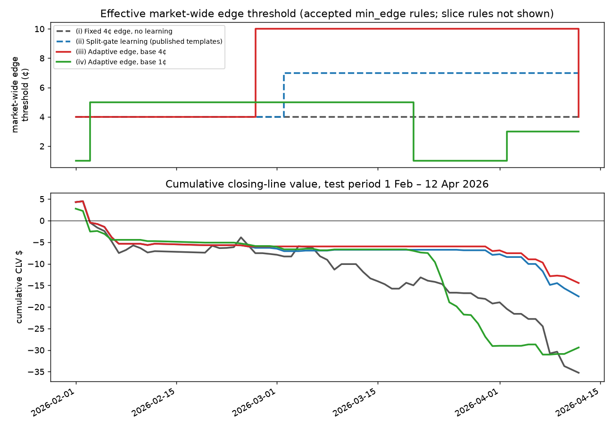

# Part 1: the agent learns its own edge threshold

**Question.** The no-gate finding (`edge_gate.md`) was that CLV per contract is flat across gap sizes, so the 4¢ threshold mainly sets volume. Can the agent's own learning loop (reviewer → split gate → notebook) find a better threshold than a fixed 4¢?

**Design (pre-stated, fixed in code before running the test period).**
- New review templates (`EDGE_TEMPLATES` in `agents/graph.py`, on only with `adaptive_edge=True` / `--edge-templates`): market-wide thresholds 2, 3, 5, 7, 10¢; slice thresholds 8¢ on underdogs (price ≤ 35%), 10¢ on long shots (≤ 25%), 7¢ when the news is stale (≥ 30 min). The published skip templates stay; the published single 7¢ template is replaced by the market-wide set.
- Semantics: the newest accepted market-wide `min_edge` rule *sets* the threshold (it can raise or lower the base); it supersedes the previous one through `valid_until` (history kept). Slice rules can only raise it. Default agent: unchanged (max of base and every rule).
- Reviewer: largest CLV-dollar gain on the last 7 market days. Raising/skip: the CLV $ of the trades removed. Lowering: the counterfactual CLV $ (mid at tip − price paid) of the first decision per untraded game that the current threshold blocked and the new one would let through.
- Gate (unchanged split gate): back-test the notebook with vs without the rule on the 14 market days before those 7; accept if CLV $ improves by ≥ $2 over ≥ 3 changed trades.
- Metric: CLV $ and P&L after fees on 2026-02-01–2026-04-12, day-clustered bootstrap (2000 reps, seed 7606). Empty notebook on 1 Feb; gate back-tests may use January days (M4 is trained before 1 Feb, so those days are in-sample for M4 — same as the published gate audit).

## Results (full test period)

| Setup | Rules proposed / accepted (edge) | Trades | Mean CLV/contract [95% CI] | CLV $ [95% CI] | P&L after fees [95% CI] |
| --- | --- | --- | --- | --- | --- |
| (i) Fixed 4¢ edge, no learning | 0 / 0 (0) | 129 | -0.35¢ [-0.65, +0.00] | -35 [-60, -12] | -247 [-718, +265] |
| (ii) Split-gate learning (published templates) | 11 / 5 (1) | 53 | -0.50¢ [-1.01, +0.19] | -18 [-34, -2] | -96 [-437, +247] |
| (iii) Adaptive edge, base 4¢ | 10 / 5 (1) | 42 | -0.45¢ [-1.07, +0.41] | -14 [-31, +1] | -102 [-359, +171] |
| (iv) Adaptive edge, base 1¢ | 16 / 8 (2) | 80 | -0.39¢ [-0.74, -0.01] | -29 [-49, -12] | -422 [-735, -138] |

## Paired differences (same game-days)

| Sample | Comparison | Metric | Difference [95% CI] | p (one-sided, a > b) |
| --- | --- | --- | --- | --- |
| full | (ii) Split-gate learning (published templates) − (i) Fixed 4¢ edge, no learning | clv_dollars | +18 [+1, +34] | 0.020 |
| full | (ii) Split-gate learning (published templates) − (i) Fixed 4¢ edge, no learning | pnl | +151 [-238, +541] | 0.222 |
| full | (iii) Adaptive edge, base 4¢ − (i) Fixed 4¢ edge, no learning | clv_dollars | +21 [+4, +38] | 0.011 |
| full | (iii) Adaptive edge, base 4¢ − (i) Fixed 4¢ edge, no learning | pnl | +145 [-272, +561] | 0.255 |
| full | (iii) Adaptive edge, base 4¢ − (ii) Split-gate learning (published templates) | clv_dollars | +3 [+0, +6] | 0.037 |
| full | (iii) Adaptive edge, base 4¢ − (ii) Split-gate learning (published templates) | pnl | -6 [-199, +198] | 0.533 |
| full | (iv) Adaptive edge, base 1¢ − (i) Fixed 4¢ edge, no learning | clv_dollars | +6 [-19, +32] | 0.314 |
| full | (iv) Adaptive edge, base 1¢ − (i) Fixed 4¢ edge, no learning | pnl | -174 [-731, +357] | 0.746 |
| full | (iv) Adaptive edge, base 1¢ − (ii) Split-gate learning (published templates) | clv_dollars | -12 [-32, +7] | 0.874 |
| full | (iv) Adaptive edge, base 1¢ − (ii) Split-gate learning (published templates) | pnl | -325 [-766, +77] | 0.927 |

## Threshold the agent ended up at

**(ii) Split-gate learning (published templates)** — market-wide threshold: 4¢ from 2026-02-01 → 7¢ from 2026-03-02. 1 accepted / 1 rejected `min_edge` proposals.

| Rule | Status | Slice | Edge | Gate decided | Superseded | Gate days | CLV $ without → with | Changed trades |
| --- | --- | --- | --- | --- | --- | --- | --- | --- |
| r003 | rejected | all games | 7¢ | 2026-02-06 | – | 2026-01-16 – 2026-01-29 | -6.58 → -4.63 | 16 |
| r006 | active | all games | 7¢ | 2026-03-02 | – | 2026-02-03 – 2026-02-22 | -10.18 → -5.02 | 7 |

**(iii) Adaptive edge, base 4¢** — market-wide threshold: 4¢ from 2026-02-01 → 10¢ from 2026-02-26 → 4¢ from 2026-04-12. 1 accepted / 2 rejected `min_edge` proposals.

| Rule | Status | Slice | Edge | Gate decided | Superseded | Gate days | CLV $ without → with | Changed trades |
| --- | --- | --- | --- | --- | --- | --- | --- | --- |
| r003 | rejected | all games | 7¢ | 2026-02-06 | – | 2026-01-16 – 2026-01-29 | -6.58 → -4.63 | 16 |
| r006 | active | all games | 10¢ | 2026-02-26 | – | 2026-01-30 – 2026-02-12 | -9.54 → -4.83 | 16 |
| r007 | rejected | all games | 3¢ | 2026-04-02 | – | 2026-03-12 – 2026-03-25 | +0.00 → -7.58 | 11 |

**(iv) Adaptive edge, base 1¢** — market-wide threshold: 1¢ from 2026-02-01 → 5¢ from 2026-02-03 → 1¢ from 2026-03-20 → 3¢ from 2026-04-02. 2 accepted / 6 rejected `min_edge` proposals.

| Rule | Status | Slice | Edge | Gate decided | Superseded | Gate days | CLV $ without → with | Changed trades |
| --- | --- | --- | --- | --- | --- | --- | --- | --- |
| r001 | active | all games | 5¢ | 2026-02-03 | – | 2026-01-13 – 2026-01-26 | -15.33 → -8.70 | 41 |
| r006 | rejected | all games | 10¢ | 2026-03-03 | – | 2026-02-04 – 2026-02-23 | -2.56 → -1.37 | 6 |
| r007 | rejected | all games | 7¢ | 2026-03-25 | – | 2026-03-04 – 2026-03-17 | -0.03 → +0.32 | 1 |
| r008 | rejected | all games | 10¢ | 2026-03-26 | – | 2026-03-05 – 2026-03-18 | -0.03 → +0.00 | 3 |
| r009 | rejected | all games | 5¢ | 2026-03-27 | – | 2026-03-06 – 2026-03-19 | -1.68 → -0.16 | 11 |
| r011 | rejected | {'side_price_max': 0.25} | 10¢ | 2026-03-29 | – | 2026-03-08 – 2026-03-21 | -0.52 → -0.52 | 0 |
| r013 | rejected | {'side_price_max': 0.35} | 8¢ | 2026-03-31 | – | 2026-03-10 – 2026-03-23 | -2.95 → -0.84 | 2 |
| r015 | active | all games | 3¢ | 2026-04-02 | – | 2026-03-12 – 2026-03-25 | -12.25 → -7.70 | 3 |

## Reading

**Verdict.** Given an edge ladder, the agent learned to *raise* its threshold: from base 4¢ the gate accepted 10¢ on 26 Feb (held-out CLV $ −9.54 → −4.83 over 16 changed trades) and rejected a later move down to 3¢; the 10¢ rule expired after its 45 days on 12 Apr. That beats no learning by +$21 CLV [+4, +38] (p = 0.011), but it only edges the published split-gate learner, by +$3 [+0, +6], with P&L indistinguishable (−$6 [−199, +198]). It wins the same way the published learner does: by trading less (42 vs 53 vs 129 trades), not by finding better trades. CLV per contract stays negative (−0.45¢) and its CI still covers the other arms. Starting lower (1¢) lets the learner climb only to 5¢ and later drop back, ending at 80 trades and −$29, worse than the published learner. Conclusion: a learned threshold is a safe, slightly better replacement for the fixed 7¢ template, not a source of edge; consistent with `edge_gate.md`, the M4 gap does not predict CLV.

Caveats: one test period (49 market days), one seed of the replay (deterministic); the counterfactual used by the reviewer for lowering ignores later re-entries, but the gate's back-test is exact. Gate back-tests early in February use January days on which M4 is in-sample.

