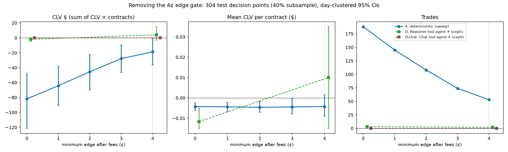

# Removing the 4¢ edge gate

Question: do the extra trades the agents place when the minimum edge after fees is 0 (instead of 4¢) beat the closing line? Fees are still charged and every other setting is unchanged (stake $20, caps $50/$100/$300, fills at the ask plus the Kalshi fee, default M4, no learning unless stated). Same 304 test decision points (fixed 40% subsample, seed 7606) as `llm_agent.md`. For the LLM arms the prompt text changes ("more than 0" instead of "more than 0.04"), so most calls are new. CLV is per contract against the mid at tip; CLV $ = CLV × contracts. 95% CIs from a day-clustered bootstrap (2000 replicates, seed 7606).

**Summary.** Without the gate the deterministic agent trades 188 times instead of 53; the extra trades lose to the close at the same rate per contract, so CLV $ falls from -19 [-36, -1] to -82 [-121, -48] (paired difference -63 [-104, -32]). With the sceptic, the reasoner agent goes from 2 to 3 trades: it proposes 110 orders at edge 0 and the sceptic vetoes 107 of them (69 of 70 low-edge ones), so it still holds the line without the gate.

## Deterministic agent (A): CLV vs minimum edge

| Min edge | Trades | Mean CLV [95% CI] | CLV $ [95% CI] | P&L after fees [95% CI] | Win rate |
| --- | --- | --- | --- | --- | --- |
| 0¢ | 188 | -0.0043 [-0.0061, -0.0024] | -82 [-121, -48] | -681 [-1,456, +145] | 41% |
| 1¢ | 145 | -0.0044 [-0.0065, -0.0022] | -64 [-91, -38] | -857 [-1,357, -315] | 37% |
| 2¢ | 108 | -0.0046 [-0.0071, -0.0018] | -45 [-70, -22] | -630 [-1,053, -201] | 37% |
| 3¢ | 74 | -0.0045 [-0.0079, -0.0003] | -28 [-46, -9] | -404 [-741, -58] | 39% |
| 4¢ | 53 | -0.0042 [-0.0090, +0.0015] | -19 [-36, -1] | -236 [-538, +73] | 40% |

## Every arm at 4¢ vs 0

| Arm | Min edge | Trades | Mean CLV [95% CI] | CLV $ [95% CI] | P&L after fees [95% CI] | Win rate |
| --- | --- | --- | --- | --- | --- | --- |
| A. Deterministic anchor agent | 4¢ | 53 | -0.0042 [-0.0090, +0.0015] | -19 [-36, -1] | -236 [-538, +73] | 40% |
| A. Deterministic anchor agent | 0¢ | 188 | -0.0043 [-0.0061, -0.0024] | -82 [-121, -48] | -681 [-1,456, +145] | 41% |
| D. Reasoner tool agent + sceptic | 4¢ | 2 | +0.0100 [-0.0150, +0.0350] | +4 [-3, +15] | +100 [-62, +363] | 50% |
| D. Reasoner tool agent + sceptic | 0¢ | 3 | -0.0117 [-0.0150, -0.0050] | -2 [-5, +0] | +6 [-57, +64] | 67% |
| D-chat. Chat tool agent + sceptic | 4¢ | 0 | – | +0 [+0, +0] | +0 [+0, +0] | – |
| D-chat. Chat tool agent + sceptic | 0¢ | 0 | – | +0 [+0, +0] | +0 [+0, +0] | – |

Not run at edge 0 (no row above): C. Reasoner tool agent, no sceptic; A, full test period, no learning; Split gate + learning, full test period.

Paired difference, edge 0 minus 4¢, on the same game-days (p one-sided for edge 0 > 4¢):

| Arm | Metric | Difference [95% CI] | p |
| --- | --- | --- | --- |
| A. Deterministic anchor agent | mean CLV | -0.0000 [-0.0049, +0.0039] | 0.484 |
| A. Deterministic anchor agent | CLV $ | -63 [-104, -32] | 0.997 |
| A. Deterministic anchor agent | P&L | -445 [-1,136, +309] | 0.875 |
| D. Reasoner tool agent + sceptic | mean CLV | -0.0217 [-0.0500, +0.0100] | 0.819 |
| D. Reasoner tool agent + sceptic | CLV $ | -6 [-18, +2] | 0.858 |
| D. Reasoner tool agent + sceptic | P&L | -94 [-378, +81] | 0.770 |
| D-chat. Chat tool agent + sceptic | mean CLV | +0.0000 [+0.0000, +0.0000] | nan |
| D-chat. Chat tool agent + sceptic | CLV $ | +0 [+0, +0] | nan |
| D-chat. Chat tool agent + sceptic | P&L | +0 [+0, +0] | nan |

## Where the difference comes from

Trades at edge 0 split by their gap after fees, and matched to the 4¢ run on (game, decision time, contract, side). With one position per game, a low-edge trade can pre-empt a later, larger-edge trade on the same game, so a few 4¢ trades disappear.

| Arm | Trades | n | Mean CLV [95% CI] | CLV $ [95% CI] | P&L [95% CI] | Win rate |
| --- | --- | --- | --- | --- | --- | --- |
| A. Deterministic anchor agent | low-edge trades (gap ≤ 4¢), edge 0 | 137 | -0.0043 [-0.0063, -0.0023] | -64 [-104, -32] | -486 [-1,190, +282] | 42% |
| A. Deterministic anchor agent | normal trades (gap > 4¢), edge 0 | 51 | -0.0042 [-0.0092, +0.0016] | -18 [-35, -0] | -195 [-502, +127] | 41% |
| A. Deterministic anchor agent | same trade as at 4¢ | 51 | -0.0042 [-0.0092, +0.0016] | -18 [-35, -0] | -195 [-502, +127] | 41% |
| A. Deterministic anchor agent | new at edge 0 | 137 | -0.0043 [-0.0063, -0.0023] | -64 [-104, -32] | -486 [-1,190, +282] | 42% |
| A. Deterministic anchor agent | 4¢ trades lost at edge 0 | 2 | -0.0050 [-0.0050, -0.0050] | -1 [-3, +0] | -41 [-104, +0] | 0% |
| D. Reasoner tool agent + sceptic | low-edge trades (gap ≤ 4¢), edge 0 | 1 | -0.0150 [-0.0150, -0.0150] | -1 [-4, +0] | -21 [-63, +0] | 0% |
| D. Reasoner tool agent + sceptic | normal trades (gap > 4¢), edge 0 | 2 | -0.0100 [-0.0150, -0.0050] | -1 [-2, +0] | +27 [+0, +69] | 100% |
| D. Reasoner tool agent + sceptic | same trade as at 4¢ | 0 | – | – | – | – |
| D. Reasoner tool agent + sceptic | new at edge 0 | 3 | -0.0117 [-0.0150, -0.0050] | -2 [-5, +0] | +6 [-57, +64] | 67% |
| D. Reasoner tool agent + sceptic | 4¢ trades lost at edge 0 | 2 | +0.0100 [-0.0150, +0.0350] | +4 [-3, +15] | +100 [-62, +363] | 50% |
| D-chat. Chat tool agent + sceptic | low-edge trades (gap ≤ 4¢), edge 0 | 0 | – | – | – | – |
| D-chat. Chat tool agent + sceptic | normal trades (gap > 4¢), edge 0 | 0 | – | – | – | – |
| D-chat. Chat tool agent + sceptic | same trade as at 4¢ | 0 | – | – | – | – |
| D-chat. Chat tool agent + sceptic | new at edge 0 | 0 | – | – | – | – |
| D-chat. Chat tool agent + sceptic | 4¢ trades lost at edge 0 | 0 | – | – | – | – |

## Sceptic (D)

Vetoed CLV is counterfactual: the side's mid at tip minus the price the order would have paid.

| Arm | Min edge | Sceptic calls | Vetoes | Vetoed mean CLV | Kept mean CLV | Low-edge (≤ 4¢) calls / vetoes (vetoed CLV) | Gap > 4¢ calls / vetoes (vetoed CLV) |
| --- | --- | --- | --- | --- | --- | --- | --- |
| D. Reasoner tool agent + sceptic | 0¢ | 110 | 107 | -0.0049 | -0.0117 | 70 / 69 (-0.0043) | 40 / 38 (-0.0059) |
| D. Reasoner tool agent + sceptic | 4¢ | 42 | 40 | -0.0047 | +0.0100 | 0 / 0 (–) | 42 / 40 (-0.0047) |
| D-chat. Chat tool agent + sceptic | 0¢ | 29 | 29 | -0.0040 | – | 23 / 23 (-0.0046) | 6 / 6 (-0.0017) |
| D-chat. Chat tool agent + sceptic | 4¢ | 4 | 4 | -0.0025 | – | 0 / 0 (–) | 4 / 4 (-0.0025) |

DeepSeek calls fetched for the edge-0 runs (not cache hits): 2,084, 2,408,546 / 1,989,299 tokens in / out, about $2.84 at the list prices in `agents/llm_client.PRICES`.

