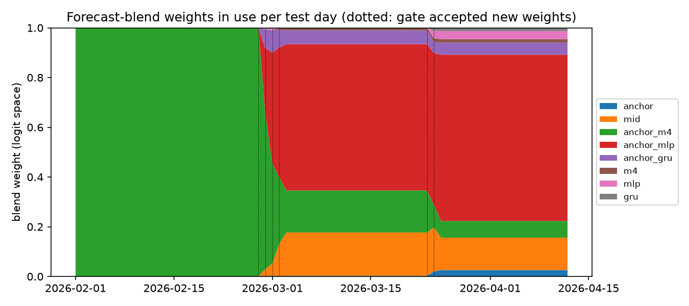

# Forecast-blend subloop

`agents/forecast_blend.py`: p(home) = sigmoid(Σ w_k · logit(signal_k)), w on the simplex, so a one-hot weight on *anchor + M4 shift* is the published agent. After each settled test day the learner refits w on settled games only (exponentiated gradient on log loss, L2 pull toward the current weights) and a split gate accepts the proposal only if **Brier (primary metric, fixed up front)** on held-out earlier days improves by ≥ 0.0005. Windows: gate days = the 7 market days before the last 7; fit = the other days of the last 42; the first review needs 21 settled days. Starting weights: one-hot on anchor + M4 shift.

Test period 2026-02-01–2026-04-12, 501 games. Day-clustered bootstrap, 2000 replicates, seed 7606. Inputs are all as-of: M4 and M4-NN were trained on games before 1 Feb; the 1 h mid is public before the 30 min decision. No LLM, deterministic.

Gate decisions: 6 accepted, 38 rejected, 20 deferred (warm-up). Final weights: anchor 0.03, mid 0.13, anchor_m4 0.07, anchor_mlp 0.67, anchor_gru 0.05, m4 0.01, mlp 0.03, gru 0.01.

## Forecast accuracy (all 501 test games; blends are walk-forward)

| Predictor | Brier | Log loss | Brier − agent [95% CI] | Log loss − agent [95% CI] | Brier − market at tip [95% CI] |
| --- | --- | --- | --- | --- | --- |
| Market 24 h before tip (anchor) | 0.1676 | 0.5072 | +0.0012 [-0.0019, +0.0043] | +0.0032 [-0.0052, +0.0109] | +0.0043 [+0.0007, +0.0084] |
| Market 1 h before tip | 0.1641 | 0.4973 | -0.0022 [-0.0066, +0.0020] | -0.0067 [-0.0171, +0.0033] | +0.0009 [-0.0005, +0.0023] |
| Market at tip | 0.1633 | 0.4956 | -0.0031 [-0.0072, +0.0009] | -0.0083 [-0.0186, +0.0012] | +0.0000 [+0.0000, +0.0000] |
| Anchor + M4 shift (agent) | 0.1663 | 0.5040 | +0.0000 [+0.0000, +0.0000] | +0.0000 [+0.0000, +0.0000] | +0.0031 [-0.0009, +0.0072] |
| Anchor + MLP shift | 0.1632 | 0.4972 | -0.0032 [-0.0079, +0.0013] | -0.0068 [-0.0237, +0.0131] | -0.0001 [-0.0050, +0.0052] |
| Anchor + GRU shift | 0.1642 | 0.4975 | -0.0022 [-0.0058, +0.0012] | -0.0065 [-0.0159, +0.0029] | +0.0009 [-0.0030, +0.0049] |
| M4 raw | 0.1827 | 0.5476 | +0.0164 [+0.0093, +0.0232] | +0.0436 [+0.0250, +0.0607] | +0.0195 [+0.0115, +0.0279] |
| Blend: blend (all inputs) | 0.1654 | 0.5017 | -0.0010 [-0.0039, +0.0017] | -0.0023 [-0.0123, +0.0096] | +0.0021 [-0.0020, +0.0065] |
| Blend: no market inputs (raw M4, MLP, GRU) | 0.1839 | 0.5506 | +0.0175 [+0.0099, +0.0246] | +0.0467 [+0.0274, +0.0639] | +0.0206 [+0.0130, +0.0286] |
| Blend: market only (anchor, mid) | 0.1663 | 0.5037 | -0.0000 [-0.0030, +0.0030] | -0.0002 [-0.0083, +0.0074] | +0.0031 [+0.0000, +0.0065] |
| Blend: all minus anchor | 0.1653 | 0.5017 | -0.0010 [-0.0040, +0.0017] | -0.0023 [-0.0124, +0.0096] | +0.0021 [-0.0020, +0.0065] |
| Blend: all minus mid | 0.1655 | 0.5028 | -0.0008 [-0.0040, +0.0022] | -0.0011 [-0.0127, +0.0131] | +0.0023 [-0.0021, +0.0068] |
| Blend: all minus anchor_m4 | 0.1656 | 0.5022 | -0.0007 [-0.0044, +0.0030] | -0.0018 [-0.0135, +0.0105] | +0.0024 [-0.0016, +0.0065] |
| Blend: all minus anchor_mlp | 0.1654 | 0.5012 | -0.0010 [-0.0024, +0.0005] | -0.0027 [-0.0066, +0.0010] | +0.0021 [-0.0014, +0.0058] |
| Blend: all minus anchor_gru | 0.1653 | 0.5017 | -0.0010 [-0.0040, +0.0017] | -0.0023 [-0.0125, +0.0097] | +0.0021 [-0.0020, +0.0065] |
| Blend: all minus m4 | 0.1654 | 0.5017 | -0.0010 [-0.0039, +0.0017] | -0.0023 [-0.0123, +0.0094] | +0.0021 [-0.0020, +0.0064] |
| Blend: all minus mlp | 0.1653 | 0.5018 | -0.0010 [-0.0041, +0.0017] | -0.0022 [-0.0128, +0.0106] | +0.0020 [-0.0021, +0.0064] |
| Blend: all minus gru | 0.1653 | 0.5018 | -0.0010 [-0.0040, +0.0017] | -0.0022 [-0.0126, +0.0102] | +0.0021 [-0.0020, +0.0064] |

## Trading (simplified offline trader, same for every forecaster)

Quotes: Kalshi quotes 30 min before tip (replay price table). One decision per game on the home market 30 min before tip, edge > 4¢ after fees, $20 stake, no volume cap, no notebook rules. This is not the full agent replay, so absolute numbers differ from `gate_audit.md`; the comparison isolates the probability.

| Forecaster | Trades | Mean CLV [95% CI] | CLV $ [95% CI] | P&L after fees [95% CI] |
| --- | --- | --- | --- | --- |
| Anchor + M4 shift (agent) | 104 | -0.0059 [-0.0087, -0.0027] | -37 [-55, -20] | -239 [-670, +197] |
| Anchor + MLP shift | 180 | -0.0041 [-0.0056, -0.0027] | -31 [-45, -19] | +90 [-477, +689] |
| Blend (all inputs) | 98 | -0.0034 [-0.0063, -0.0003] | -19 [-35, -5] | -243 [-638, +131] |
| Blend, no market inputs | 339 | -0.0049 [-0.0059, -0.0040] | -176 [-212, -141] | -2003 [-3047, -885] |

| Paired comparison | Metric | Difference [95% CI] |
| --- | --- | --- |
| Blend (all inputs) − Anchor + M4 shift | clv_dollars | +18 [+4, +33] |
| Blend (all inputs) − Anchor + M4 shift | pnl | -4 [-365, +378] |
| Anchor + MLP shift − Anchor + M4 shift | clv_dollars | +6 [-11, +24] |
| Anchor + MLP shift − Anchor + M4 shift | pnl | +329 [-219, +897] |
| Blend, no market inputs − Anchor + M4 shift | clv_dollars | -139 [-170, -106] |
| Blend, no market inputs − Anchor + M4 shift | pnl | -1764 [-2727, -737] |

Reading: the blend trades about as often as the agent but loses less CLV per contract; the CLV-dollar gain survives real quotes (an earlier run on approximate quotes, 1 h mid ± 1¢, gave +$19 [+2, +37]), while P&L is indistinguishable. Part of the gain can come from the 1 h mid input pulling the estimate toward the traded price (fewer, smaller disagreements with the market). The forecast gain is not significant: Brier −0.0010 vs the agent, and still behind anchor + MLP alone and the market at tip.

## Weight log

Accepted proposals (full log in `forecast_blend_log.json`):

- 2026-02-27: mid 0.03, anchor_m4 0.62, anchor_mlp 0.26, anchor_gru 0.08, mlp 0.01 — held-out Brier 0.2086 -> 0.2049 on 54 games (2026-02-08..2026-02-20); need -0.0005
- 2026-02-28: mid 0.05, anchor_m4 0.40, anchor_mlp 0.45, anchor_gru 0.09, mlp 0.01 — held-out Brier 0.1939 -> 0.1915 on 56 games (2026-02-09..2026-02-21); need -0.0005
- 2026-03-01: mid 0.13, anchor_m4 0.27, anchor_mlp 0.52, anchor_gru 0.07, m4 0.01 — held-out Brier 0.1975 -> 0.1966 on 57 games (2026-02-10..2026-02-22); need -0.0005
- 2026-03-02: mid 0.17, anchor_m4 0.17, anchor_mlp 0.59, anchor_gru 0.06, m4 0.01 — held-out Brier 0.1954 -> 0.1947 on 56 games (2026-02-11..2026-02-23); need -0.0005
- 2026-03-23: anchor 0.02, mid 0.18, anchor_m4 0.09, anchor_mlp 0.61, anchor_gru 0.05, m4 0.01, mlp 0.03, gru 0.01 — held-out Brier 0.1438 -> 0.1433 on 56 games (2026-03-10..2026-03-16); need -0.0005
- 2026-03-24: anchor 0.03, mid 0.13, anchor_m4 0.07, anchor_mlp 0.67, anchor_gru 0.05, m4 0.01, mlp 0.03, gru 0.01 — held-out Brier 0.1271 -> 0.1266 on 53 games (2026-03-11..2026-03-17); need -0.0005

## Not built (future work)

- **Cross-venue prices** (Polymarket, DraftKings; `evaluation/venue_compare.py`): not added as inputs this round; they need an as-of timestamp audit before they can enter a blend.
- **M2-based missing-player impact** (expected minutes/points of absent players from M2 medians).
- **NBA injury-report PDFs** (`data/raw/injury_reports`, 2,637 files) are not in the frozen news; a parsed, timestamped table would give earlier injury information than the tip − 30 min ESPN list.
- **Shift-baseline fix**: the shift's "before" uses out=[], double-counting absences already known at anchor time; not fixed here.
- **M6** predicted move was left out (no cached per-game test predictions at the 30 min decision); **M3** (play model) predicts a different target (player participation), so it has no direct role in a game-winner probability beyond what M4's absence features already use.
- The blend is not yet wired into `MarketAgent` replays (`--forecast blend`); trading numbers above come from the simplified offline trader.

