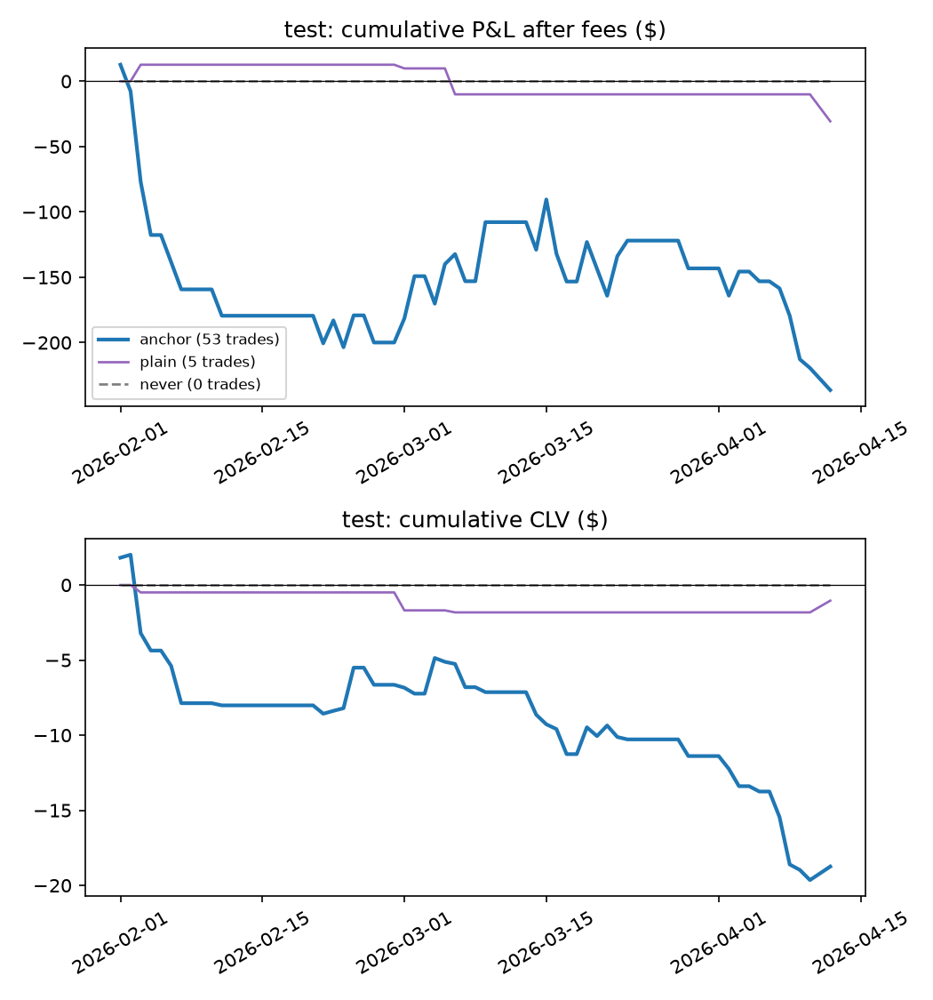

# LLM tool agent vs deterministic agent vs plain LLM vs never trade

Pre-registration: `docs/preregistration_llm_agent.md`. Same replay as the existing test runs: stake $20, caps $50/$100/$300, fills at the ask (or 1 − bid) plus the Kalshi fee, capped by volume; default M4 (trained before 1 Feb); no learning. CLV is per contract against the mid at tip. 95% CIs and one-sided p-values from a day-clustered bootstrap (2000 replicates, seed 7606).

## test: 2026-02-01 – 2026-04-12 (64 game-days)

**Model deviation from the pre-registration.** The pre-registered `gemini-2.5-flash` is no longer available to new API keys (404), and the free-tier quota for `gemini-3.8-flash` is 20 requests per day. All LLM arms therefore used `gemini-3.5-flash-lite` (free tier, about 15 requests per minute). Prompts, tools, validation and the trading rule are unchanged.

LLM: `gemini-3.5-flash-lite`, temperature 0. Decision points: fixed 40% subsample (seed 7606), same for every setup.

| Setup | Trades | Mean CLV [95% CI] | CLV $ [95% CI] | P&L after fees [95% CI] | p (CLV > 0) |
| --- | --- | --- | --- | --- | --- |
| A. Deterministic anchor agent (no learning) | 53 | -0.0042 [-0.0090, +0.0015] | -19 [-36, -1] | -236 [-538, +73] | 0.959 |
| B. Plain LLM, one call (no tools) | 5 | -0.0030 [-0.0150, +0.0150] | -1 [-4, +2] | -31 [-96, +22] | 0.741 |
| Never trade | 0 | – | +0 [+0, +0] | +0 [+0, +0] | – |

Paired differences on the same game-days (first minus second; p is one-sided for first > second):

| Comparison | Metric | Difference [95% CI] | p |
| --- | --- | --- | --- |
| anchor − never | CLV $ | -19 [-36, -1] | 0.983 |
| anchor − never | P&L | -236 [-538, +73] | 0.932 |
| plain − anchor | mean CLV | +0.0012 [-0.0090, +0.0155] | 0.383 |
| plain − anchor | CLV $ | +18 [+1, +35] | 0.019 |
| plain − anchor | P&L | +206 [-113, +528] | 0.109 |
| plain − never | CLV $ | -1 [-4, +2] | 0.764 |
| plain − never | P&L | -31 [-96, +22] | 0.834 |

Agent diagnostics:

| Setup | Decision points (LLM asked) | Tool calls / decision | Buy proposals | Invalid (rate) | Gap fails | Sceptic rejects / calls | Vetoed vs kept CLV | Trades outside A's games | LLM calls (cache hits) | Tokens in / out | Cost | Latency / call |
| --- | --- | --- | --- | --- | --- | --- | --- | --- | --- | --- | --- | --- |
| plain | 304 (304) | 0.0 | 303 | 1 (0.3%) | 298 | – | – | 60% | 304 (224) | 174,816 / 15,773 | $0.02 | 2.80s |

Invalid outputs by reason: plain: {'invalid_json': 1}

Tool use: 

## Tool agent arms (C, D): not run

The tool agent without the sceptic (C) and with the priced-in sceptic (D) were **not scored**. The free-tier daily
quota for `gemini-3.5-flash-lite` (about 500 requests) ran out partway through arm C. On a nested ~100-point
subsample (fraction 0.13 of the same seed, 117 decision points), 32 analyst decisions returned valid output, and all
32 were **pass** (no buy proposals, no invalid outputs). The other 85 failed with HTTP 429 quota errors and placed no
trade. A retry with `gemini-3.5-flash` ran at about 3 requests per minute (high demand), too slow for the deadline.
So H1 (tool agent vs A), H2 (sceptic effect) and the sceptic reject rate have **no result**. H3 is answered only for
the plain LLM (B). To finish once the quota resets (cached calls are free):

    python -m evaluation.llm_agent_eval --window test --backend gemini --model gemini-3.5-flash-lite --subsample 0.4 --setups tool,tool_sceptic --workers 3 --min-interval 12 --report test

Costs are estimates from token counts at the list prices in `agents/llm_client.PRICES` (Gemini 3.5 Flash-Lite assumed at the 2.5 Flash-Lite price, $0.10 / $0.40 per million input / output tokens; the runs themselves used the free tier) and include calls served from the cache, i.e. the cost of a fresh run. Latency is per API call as measured when the response was first fetched.
