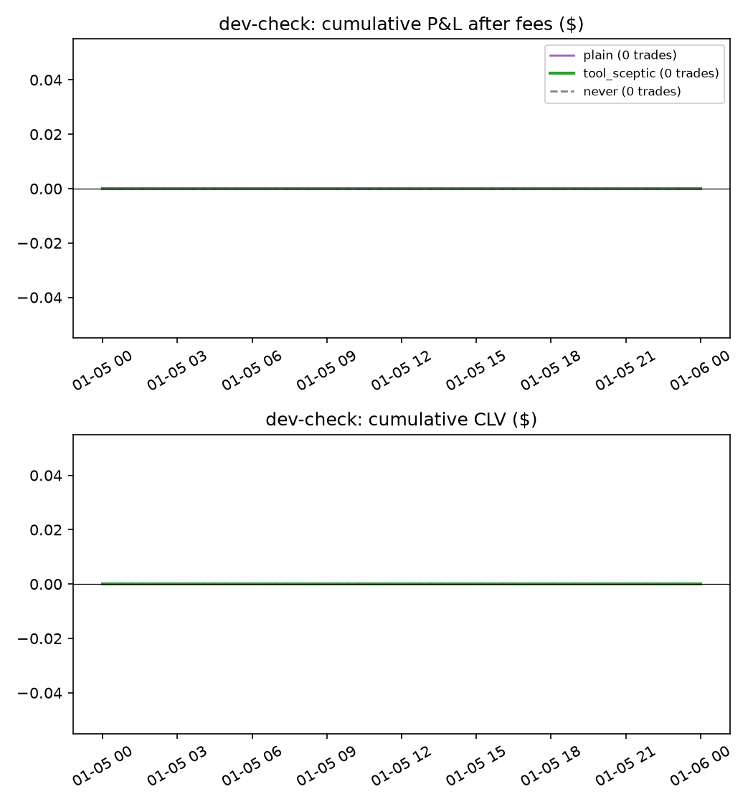

# LLM tool agent vs deterministic agent vs plain LLM vs never trade

Pre-registration: `docs/preregistration_llm_agent.md`. Same replay as the existing test runs: stake $20, caps $50/$100/$300, fills at the ask (or 1 − bid) plus the Kalshi fee, capped by volume; default M4 (trained before 1 Feb); no learning. CLV is per contract against the mid at tip. 95% CIs and one-sided p-values from a day-clustered bootstrap (2000 replicates, seed 7606).

## dev-check: 2026-01-05 – 2026-01-06 (2 game-days)

LLM: `gemini-3.5-flash-lite`, temperature 0. Decision points: all.

| Setup | Trades | Mean CLV [95% CI] | CLV $ [95% CI] | P&L after fees [95% CI] | p (CLV > 0) |
| --- | --- | --- | --- | --- | --- |
| B. Plain LLM, one call (no tools) | 0 | – | +0 [+0, +0] | +0 [+0, +0] | – |
| D. Tool agent + priced-in sceptic | 0 | – | +0 [+0, +0] | +0 [+0, +0] | – |
| Never trade | 0 | – | +0 [+0, +0] | +0 [+0, +0] | – |

Paired differences on the same game-days (first minus second; p is one-sided for first > second):

| Comparison | Metric | Difference [95% CI] | p |
| --- | --- | --- | --- |
| plain − never | CLV $ | +0 [+0, +0] | – |
| plain − never | P&L | +0 [+0, +0] | – |
| tool_sceptic − never | CLV $ | +0 [+0, +0] | – |
| tool_sceptic − never | P&L | +0 [+0, +0] | – |

Agent diagnostics:

| Setup | Decision points (LLM asked) | Tool calls / decision | Buy proposals | Invalid (rate) | Gap fails | Sceptic rejects / calls | Vetoed vs kept CLV | Trades outside A's games | LLM calls (cache hits) | Tokens in / out | Cost | Latency / call |
| --- | --- | --- | --- | --- | --- | --- | --- | --- | --- | --- | --- | --- |
| plain | 20 (20) | 0.0 | 16 | 0 (0.0%) | 16 | – | – | – | 20 (0) | 8,507 / 852 | $0.00 | 0.98s |
| tool_sceptic | 20 (20) | 2.4 | 0 | 0 (0.0%) | 0 | – | – | – | 29 (0) | 15,768 / 2,131 | $0.01 | 0.93s |

Invalid outputs by reason: plain: none; tool_sceptic: none

Tool use: tool_sceptic: {'get_quote': 16, 'get_anchor': 13, 'get_news': 8, 'm6_predicted_move': 7, 'm4_win_prob': 3, 'edge': 1}

Costs are list-price estimates from token counts (Gemini 2.5 Flash: $0.30 per million input tokens, $2.50 per million output tokens) and include calls served from the cache, i.e. the cost of a fresh run. Latency is per API call as measured when the response was first fetched.
