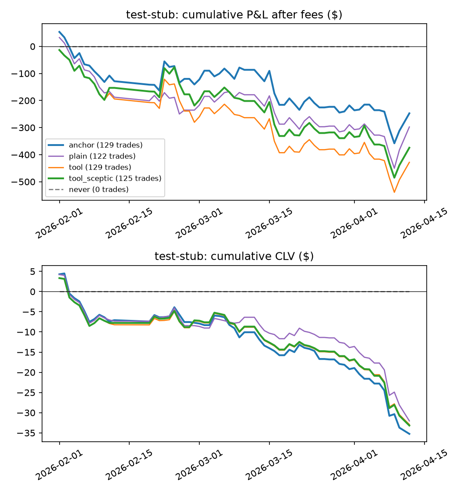

# LLM tool agent vs deterministic agent vs plain LLM vs never trade

Pre-registration: `docs/preregistration_llm_agent.md`. Same replay as the existing test runs: stake $20, caps $50/$100/$300, fills at the ask (or 1 − bid) plus the Kalshi fee, capped by volume; default M4 (trained before 1 Feb); no learning. CLV is per contract against the mid at tip. 95% CIs and one-sided p-values from a day-clustered bootstrap (2000 replicates, seed 7606).

## test-stub: 2026-02-01 – 2026-04-12 (64 game-days)

**Stub results, not Gemini.** Every LLM call was answered by the deterministic heuristic stub (`agents.tool_agent.heuristic_reply`: anchor + M4 news shift through the tool protocol; the sceptic rejects when the price already moved 3¢ toward the trade). This proves the pipeline end to end; it says nothing about how an LLM would trade. Tokens are character-count estimates and latency is local.

LLM: `heuristic-stub`, temperature 0. Decision points: all.

| Setup | Trades | Mean CLV [95% CI] | CLV $ [95% CI] | P&L after fees [95% CI] | p (CLV > 0) |
| --- | --- | --- | --- | --- | --- |
| A. Deterministic anchor agent (no learning) | 129 | -0.0035 [-0.0065, +0.0000] | -35 [-60, -12] | -247 [-718, +265] | 0.990 |
| B. Plain LLM, one call (no tools) | 122 | -0.0034 [-0.0065, +0.0002] | -32 [-57, -9] | -298 [-745, +183] | 0.985 |
| C. Tool agent, no sceptic | 129 | -0.0031 [-0.0060, +0.0001] | -33 [-57, -10] | -428 [-905, +73] | 0.985 |
| D. Tool agent + priced-in sceptic | 125 | -0.0033 [-0.0062, -0.0001] | -33 [-57, -11] | -374 [-862, +133] | 0.987 |
| Never trade | 0 | – | +0 [+0, +0] | +0 [+0, +0] | – |

Paired differences on the same game-days (first minus second; p is one-sided for first > second):

| Comparison | Metric | Difference [95% CI] | p |
| --- | --- | --- | --- |
| anchor − never | CLV $ | -35 [-60, -12] | 0.997 |
| anchor − never | P&L | -247 [-718, +265] | 0.831 |
| plain − anchor | mean CLV | +0.0001 [-0.0009, +0.0010] | 0.441 |
| plain − anchor | CLV $ | +3 [-5, +12] | 0.237 |
| plain − anchor | P&L | -50 [-280, +126] | 0.705 |
| plain − never | CLV $ | -32 [-57, -9] | 0.996 |
| plain − never | P&L | -298 [-745, +183] | 0.905 |
| tool − anchor | mean CLV | +0.0003 [-0.0004, +0.0011] | 0.168 |
| tool − anchor | CLV $ | +2 [-3, +9] | 0.228 |
| tool − anchor | P&L | -181 [-418, +14] | 0.932 |
| tool − never | CLV $ | -33 [-57, -10] | 0.998 |
| tool − never | P&L | -428 [-905, +73] | 0.959 |
| tool_sceptic − anchor | mean CLV | +0.0002 [-0.0006, +0.0010] | 0.326 |
| tool_sceptic − anchor | CLV $ | +2 [-4, +8] | 0.250 |
| tool_sceptic − anchor | P&L | -127 [-376, +89] | 0.853 |
| tool_sceptic − never | CLV $ | -33 [-57, -11] | 0.998 |
| tool_sceptic − never | P&L | -374 [-862, +133] | 0.925 |
| tool_sceptic − tool | mean CLV | -0.0002 [-0.0006, +0.0001] | 0.864 |
| tool_sceptic − tool | CLV $ | -0 [-2, +1] | 0.674 |
| tool_sceptic − tool | P&L | +54 [-8, +136] | 0.076 |

Agent diagnostics:

| Setup | Decision points (LLM asked) | Tool calls / decision | Buy proposals | Invalid (rate) | Gap fails | Sceptic rejects / calls | Vetoed vs kept CLV | Trades outside A's games | LLM calls (cache hits) | Tokens in / out | Cost | Latency / call |
| --- | --- | --- | --- | --- | --- | --- | --- | --- | --- | --- | --- | --- |
| plain | 730 (730) | 0.0 | 730 | 0 (0.0%) | 608 | – | – | 3% | 730 (0) | 268,059 / 12,394 | $0.00 | 0.00s |
| tool | 728 (728) | 6.0 | 129 | 0 (0.0%) | 0 | – | – | 6% | 2,184 (0) | 1,870,314 / 86,313 | $0.00 | 0.01s |
| tool_sceptic | 728 (728) | 6.0 | 129 | 0 (0.0%) | 0 | 4 / 129 (3%) | +0.0025 vs -0.0033 | 6% | 2,313 (2,184) | 1,968,027 / 89,405 | $0.00 | 0.01s |

Invalid outputs by reason: plain: none; tool: none; tool_sceptic: none

Tool use: tool: {'get_quote': 1456, 'get_anchor': 1456, 'get_news': 728, 'm4_win_prob': 728}; tool_sceptic: {'get_quote': 1456, 'get_anchor': 1456, 'get_news': 728, 'm4_win_prob': 728}

Costs are estimates from token counts at the list prices in `agents/llm_client.PRICES` (Gemini 3.5 Flash-Lite assumed at the 2.5 Flash-Lite price, $0.10 / $0.40 per million input / output tokens; the runs themselves used the free tier) and include calls served from the cache, i.e. the cost of a fresh run. Latency is per API call as measured when the response was first fetched.
