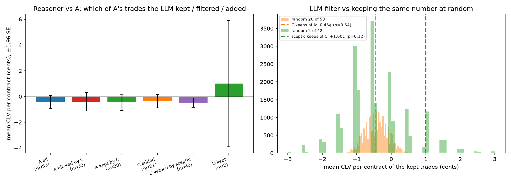

# What the DeepSeek LLM agent changes vs the original deterministic agent (A)

Decision-level comparison on the **same 304 test decision points** (1 Feb – 12 Apr 2026, fixed 40% subsample, seed 7606). A = deterministic anchor agent (market price 24 h before tip + M4 news shift). B = plain LLM (one call), C = LLM tool agent, D = C + priced-in sceptic; `chat` = `deepseek-chat`, `reasoner` = `deepseek-reasoner` (V4.1-Flash, thinking on). CLV is per contract against the mid at tip (1¢ = 0.01). CIs are 95%, day-clustered bootstrap over the 64 game-days (2000 replicates, seed 7606); random-filter baselines use 20,000 draws. No new LLM calls: everything is read from the cached runs. Script: `evaluation/llm_vs_original.py`.

## Verdict

**What the LLM improves**

- **Fewer trades, and that is most of the gain.** A makes 53 trades for CLV -18.7 $ (mean -0.42¢ per contract). The reasoner with the sceptic (D) makes 2 (+3.9 $). Its +22.7 $ over A splits into +17.7 $ from skipping 52 of A's trades, +5.0 $ from one added trade (a 14¢ longshot, 142 contracts) and +0.0 $ on the one trade both made. Any filter that keeps 2 of A's trades gets the skipping part: random 2 of 53 gives -0.7 $ [-3.7, +2.5].
- **D's 2 trades beat 2 random trades from A, but on n = 2.** Mean CLV +1.00¢ vs random -0.42¢ (p = 0.16 that random is at least as good); CLV $ +3.9 vs random [-3.7, +2.5] (the $ is driven by the contract count of one cheap longshot).
- **The sceptic's vetoes lean the right way, not significantly.** Of C's 42 reasoner trades, the 40 vetoed averaged -0.47¢ and the 2 kept +1.00¢: kept − vetoed +1.47¢ [-1.27¢, +4.25¢]; a random 2 of 42 does at least as well 12% of the time.
- **Explainability and auditability.** Every LLM trade carries a rationale that cites tool outputs, the citations are machine-checked against those outputs, and the sceptic's reasons name a concrete concern (stale 24-hour anchor, price already moved, no news behind the edge) — A's brief only shows the numbers.

**What it does not improve (or makes worse)**

- **No better selection among A's trades.** The reasoner tool agent (C) keeps 20 of A's trades and drops 33: kept -0.45¢ vs dropped -0.41¢ (kept − dropped -0.04¢ [-1.05¢, +0.82¢]); a random keep of the same size is at least as good 54% of the time. The 22 trades it adds average -0.36¢, the same as A. On outcomes (noisy) the kept A trades won 20% vs 52% for the dropped ones. D's one kept A trade was -1.50¢.
- **No better forecasts than the market.** The plain LLM's home-win probabilities beat A's Brier score (chat -0.0058 [-0.0129, +0.0000]) only because they copy the current mid (mean distance 0.13 points); vs the mid itself: -0.0007 [-0.0017, +0.0000]. "Moving toward the close" is just moving to the market, which already sits near the close: more conservative, not more informed.
- **Tool-agent estimates are more overconfident than A's.** On its 51 buy proposals the reasoner's estimate sits +9.4¢ above the mid for the side it buys (A at the same points: +4.5¢); the closing price moved -0.0¢.
- **Reliability, latency, cost.** 14% of reasoner tool-agent decisions were invalid (empty/malformed JSON, often after spending the reasoning budget; 9 buy proposals failed the citation check), all treated as passes. The reasoner tool agent needs 28 s of LLM time per decision and $1.05 per trade with the sceptic; A runs in milliseconds for free. The guardrails (checks and risk limits) never had to block either agent.

## 1. Decision-level overlap with A

Cells by decision point. "Filtered" = A traded there and the LLM did not; "added" = the LLM traded where A did not. Same/opposite side compares the direction on the home team. Win = P&L > 0.

| Model | Arm | Cell | n | Mean CLV | CLV $ | Win rate | P&L $ |
| --- | --- | --- | --- | --- | --- | --- | --- |
| chat | B plain | both_same_side (A's fills) | 3 | -1.00¢ | -1.0 | 100% | +44.0 |
| chat | B plain | both_same_side (LLM's fills) | 3 | -0.83¢ | -0.9 | 100% | +44.0 |
| chat | B plain | both_opposite (A's fills) | 0 | – | +0.0 | – | +0.0 |
| chat | B plain | A only = filtered by LLM | 50 | -0.39¢ | -17.7 | 36% | -280.4 |
| chat | B plain | LLM only = added | 0 | – | +0.0 | – | +0.0 |
| chat | C tools | both_same_side (A's fills) | 2 | +0.00¢ | +0.0 | 50% | -1.9 |
| chat | C tools | both_same_side (LLM's fills) | 2 | +0.00¢ | +0.0 | 50% | -1.9 |
| chat | C tools | both_opposite (A's fills) | 0 | – | +0.0 | – | +0.0 |
| chat | C tools | A only = filtered by LLM | 51 | -0.44¢ | -18.7 | 39% | -234.5 |
| chat | C tools | LLM only = added | 2 | -0.50¢ | -0.5 | 0% | -40.5 |
| chat | D tools+sceptic | both_same_side (A's fills) | 0 | – | +0.0 | – | +0.0 |
| chat | D tools+sceptic | both_opposite (A's fills) | 0 | – | +0.0 | – | +0.0 |
| chat | D tools+sceptic | A only = filtered by LLM | 53 | -0.42¢ | -18.7 | 40% | -236.3 |
| chat | D tools+sceptic | LLM only = added | 0 | – | +0.0 | – | +0.0 |
| reasoner | B plain | both_same_side (A's fills) | 3 | -1.00¢ | -1.0 | 100% | +44.0 |
| reasoner | B plain | both_same_side (LLM's fills) | 3 | -0.83¢ | -0.9 | 100% | +44.0 |
| reasoner | B plain | both_opposite (A's fills) | 0 | – | +0.0 | – | +0.0 |
| reasoner | B plain | A only = filtered by LLM | 50 | -0.39¢ | -17.7 | 36% | -280.4 |
| reasoner | B plain | LLM only = added | 2 | +0.50¢ | +0.6 | 0% | -40.5 |
| reasoner | C tools | both_same_side (A's fills) | 20 | -0.45¢ | -7.3 | 20% | -252.5 |
| reasoner | C tools | both_same_side (LLM's fills) | 20 | -0.45¢ | -7.3 | 20% | -252.5 |
| reasoner | C tools | both_opposite (A's fills) | 0 | – | +0.0 | – | +0.0 |
| reasoner | C tools | A only = filtered by LLM | 33 | -0.41¢ | -11.4 | 52% | +16.1 |
| reasoner | C tools | LLM only = added | 22 | -0.36¢ | -6.0 | 41% | +159.1 |
| reasoner | D tools+sceptic | both_same_side (A's fills) | 1 | -1.50¢ | -1.0 | 0% | -20.7 |
| reasoner | D tools+sceptic | both_same_side (LLM's fills) | 1 | -1.50¢ | -1.0 | 0% | -20.7 |
| reasoner | D tools+sceptic | both_opposite (A's fills) | 0 | – | +0.0 | – | +0.0 |
| reasoner | D tools+sceptic | A only = filtered by LLM | 52 | -0.40¢ | -17.7 | 40% | -215.6 |
| reasoner | D tools+sceptic | LLM only = added | 1 | +3.50¢ | +5.0 | 100% | +120.9 |

**Selection vs fewer trades.** Kept/filtered use A's own fills, so the LLM's choice is the only difference. Random filter = keep the same number of A's 53 trades at random; p = share of random draws with mean CLV at least as high as the LLM's kept set (high p = no better than random). Portfolio = the LLM's actual trades vs the same number of A's trades at random.

| Model | Arm | LLM trades (CLV $) | Kept / filtered | Kept mean CLV | Filtered mean CLV | Kept − filtered [95% CI] | Random keep: mean CLV [95%] | p (random ≥ LLM) | Random portfolio CLV $ [95%] | p (random $ ≥ LLM $) |
| --- | --- | --- | --- | --- | --- | --- | --- | --- | --- | --- |
| chat | B plain | 3 (-0.9) | 3 / 50 | -1.00¢ | -0.39¢ | -0.61¢ [-1.74¢, +0.12¢] | -0.43¢ [-2.17¢, +2.00¢] | 71% | -1.1 [-4.6, +2.7] | 42% |
| chat | C tools | 4 (-0.5) | 2 / 51 | +0.00¢ | -0.44¢ | +0.44¢ [–, –] | -0.42¢ [-2.50¢, +2.75¢] | 35% | -1.4 [-5.4, +2.9] | 31% |
| chat | D tools+sceptic | 0 (+0.0) | 0 / 53 | – | -0.42¢ | – [–, –] | – | – | – | – |
| reasoner | B plain | 5 (-0.2) | 3 / 50 | -1.00¢ | -0.39¢ | -0.61¢ [-1.74¢, +0.12¢] | -0.43¢ [-2.17¢, +2.00¢] | 71% | -1.8 [-6.3, +3.0] | 25% |
| reasoner | C tools | 42 (-13.3) | 20 / 33 | -0.45¢ | -0.41¢ | -0.04¢ [-1.05¢, +0.82¢] | -0.43¢ [-1.05¢, +0.23¢] | 54% | -14.8 [-21.2, -8.6] | 33% |
| reasoner | D tools+sceptic | 2 (+3.9) | 1 / 52 | -1.50¢ | -0.40¢ | -1.10¢ [–, –] | -0.43¢ [-3.50¢, +5.50¢] | 87% | -0.7 [-3.7, +2.5] | 0% |

**The sceptic as a filter on C (reasoner).** Of C's 42 trades the sceptic kept 2 (+1.00¢) and vetoed 40 (-0.47¢); kept − vetoed +1.47¢ [-1.27¢, +4.25¢]. Random 2 of 42: mean -0.40¢ [-2.00¢, +1.50¢], p (random ≥ sceptic) = 0.12; CLV $ random -0.7 [-3.9, +4.5] vs kept +3.9. With n = 2 this cannot show skill.

## 2. Probability estimates

Home-win probability at every decision point where all forecasters exist (n = 299). A's estimate is read from its brief (rounded to 1 point); M4 is the raw model; mid = Kalshi mid at the decision; close = mid at tip. Only the plain LLM (B) states a probability at every point; the tool agents give one only when they propose a trade (see below). Lower is better.

| Forecaster | Brier | Log loss | Mean abs. distance to close | Mean abs. distance to mid |
| --- | --- | --- | --- | --- |
| A | 0.1660 | 0.5035 | 0.0354 | 0.0340 |
| M4 | 0.1884 | 0.5600 | 0.1037 | 0.1024 |
| B_chat | 0.1603 | 0.4874 | 0.0083 | 0.0013 |
| B_reasoner | 0.1614 | 0.4905 | 0.0105 | 0.0053 |
| mid | 0.1610 | 0.4889 | 0.0072 | 0.0000 |
| close | 0.1611 | 0.4893 | 0.0000 | 0.0072 |

Paired differences (first minus second, negative = LLM better):

| LLM | vs | Metric | Difference [95% CI] |
| --- | --- | --- | --- |
| B_chat | A | brier | -0.0058 [-0.0129, +0.0000] |
| B_chat | A | abs_error_vs_close | -0.0271 [-0.0334, -0.0221] |
| B_chat | mid | brier | -0.0007 [-0.0017, +0.0000] |
| B_chat | mid | abs_error_vs_close | +0.0011 [+0.0002, +0.0023] |
| B_reasoner | A | brier | -0.0046 [-0.0119, +0.0011] |
| B_reasoner | A | abs_error_vs_close | -0.0249 [-0.0312, -0.0200] |
| B_reasoner | mid | brier | +0.0004 [-0.0008, +0.0017] |
| B_reasoner | mid | abs_error_vs_close | +0.0033 [+0.0022, +0.0045] |

Direction of the LLM's change from A's estimate (points where it differs by > 0.5 points):

| LLM | n moved | Moved toward close | Closer to the current mid than A | Mean abs. A − mid | Mean abs. LLM − mid |
| --- | --- | --- | --- | --- | --- |
| B_chat | 291 | 94% | 99% | 0.0340 | 0.0013 |
| B_reasoner | 285 | 92% | 91% | 0.0340 | 0.0053 |

On the tool agent's buy proposals (C), signed in the direction of the proposed trade (positive = estimate above the mid for the side it buys):

| Model | Buy proposals | LLM − mid | A − mid | Close − mid (what happened) | abs. LLM − close | abs. A − close | abs. mid − close | LLM within 1 pt of A |
| --- | --- | --- | --- | --- | --- | --- | --- | --- |
| chat | 18 | +6.4¢ | +1.7¢ | +0.2¢ | 0.0639 | 0.0464 | 0.0058 | 0% |
| reasoner | 51 | +9.4¢ | +4.5¢ | -0.0¢ | 0.0947 | 0.0641 | 0.0087 | 37% |

## 3. Sceptic veto reasons (reasoner D)

40 vetoes of 42 sceptic calls. Primary category by keyword rules in priority order (fail-closed → no-news model-vs-market → news already priced in → market moved against → small edge → other), then spot-checked by hand. Counterfactual CLV = side's mid at tip minus the price it would have paid; CLV $ uses C's fill for the same decision.

| Primary reason | n | Mean CLV | CLV $ avoided | Share with positive CLV (veto wrong) | A also traded |
| --- | --- | --- | --- | --- | --- |
| model-vs-market disagreement, no news | 26 | -0.65¢ | -16.2 | 19% | 35% |
| news already priced in | 12 | -0.17¢ | -0.4 | 33% | 67% |
| market moved against | 1 | -0.50¢ | -0.9 | 0% | 100% |
| sceptic failed (fail closed) | 1 | +0.50¢ | +0.1 | 100% | 100% |

Overlapping flags (a veto can mention several):

| Flag | n | Mean CLV | Share positive |
| --- | --- | --- | --- |
| no_news_model_vs_market | 26 | -0.65¢ | 19% |
| news_priced_in | 33 | -0.50¢ | 24% |
| market_moved_against | 24 | -0.54¢ | 25% |
| small_edge | 12 | -0.25¢ | 33% |
| stale_anchor | 38 | -0.58¢ | 21% |

**Vetoes the sceptic got wrong** (positive counterfactual CLV): 10 of 40, mean +1.10¢, vs 30 right (-1.00¢). Flag rates wrong vs right: no_news_model_vs_market 50% vs 70%; news_priced_in 80% vs 83%; market_moved_against 60% vs 60%; small_edge 40% vs 27%; stale_anchor 80% vs 100%. Chat D: 4 vetoes of 4, mean -0.25¢.

## 4. Quality and guardrails

| Model | Arm | Decision points (LLM asked) | Invalid (rate) | Invalid by reason | Tool calls mean / median / max | Buy proposals | Citations valid | Gap fails | Sceptic rejects | Risk blocks | Orders | Fills |
| --- | --- | --- | --- | --- | --- | --- | --- | --- | --- | --- | --- | --- |
| chat | B plain | 304 (304) | 0 (0.0%) | none | 0.0 / 0 / 0 | 304 | – | 301 | 0 | 0 | 3 | 3 |
| chat | C tools | 304 (304) | 5 (1.6%) | {'number_mismatch': 2, 'ungrounded_estimate': 3} | 7.2 / 7 / 8 | 18 | 13 (72%) | 9 | 0 | 0 | 4 | 4 |
| chat | D tools+sceptic | 304 (304) | 5 (1.6%) | {'number_mismatch': 2, 'ungrounded_estimate': 3} | 7.2 / 7 / 8 | 18 | 13 (72%) | 9 | 4 | 0 | 0 | 0 |
| reasoner | B plain | 304 (304) | 5 (1.6%) | {'invalid_json': 5} | 0.0 / 0 / 0 | 299 | – | 294 | 0 | 0 | 5 | 5 |
| reasoner | C tools | 304 (299) | 42 (14.0%) | {'invalid_json': 16, 'bad_schema': 16, 'number_mismatch': 8, 'budget_exhausted': 1, 'ungrounded_estimate': 1} | 7.8 / 8 / 8 | 51 | 42 (82%) | 0 | 0 | 0 | 42 | 42 |
| reasoner | D tools+sceptic | 304 (304) | 43 (14.1%) | {'invalid_json': 16, 'bad_schema': 16, 'number_mismatch': 8, 'budget_exhausted': 2, 'ungrounded_estimate': 1} | 7.8 / 8 / 8 | 51 | 42 (82%) | 0 | 40 | 0 | 2 | 2 |

Most common first four tool calls: chat tool: `get_quote > get_quote > get_anchor > get_news` (258×); chat tool_sceptic: `get_quote > get_quote > get_anchor > get_news` (258×); reasoner tool: `get_quote > get_quote > get_anchor > get_anchor` (213×); reasoner tool_sceptic: `get_quote > get_quote > get_anchor > get_anchor` (216×).

A (deterministic): {'brief_only': 251, 'sent': 53}; pre-trade checks {'passed': 304}; all 53 orders approved by risk and filled. The guardrails never had to stop A or the LLM at the risk stage (0 risk blocks); for the LLM the binding guardrails are earlier: output validation (citations must match tool outputs, estimate within a band of the model/market references), the code-computed 4¢ gap after fees and the sceptic. Plain B proposes a probability at every point, but 97–99% fail the gap check. "Citations valid" = buy proposals that passed the citation / number / grounding checks (plain B: no citations; its "buy proposals" are the probabilities it stated).

## 5. Same decision, side by side (reasoner)

**PHI @ LAC, 2026-02-03 02:30 UTC** — A and C both buy; the sceptic vetoes

- A: LAC win: estimate 59% (market 56% a day earlier, news shift +3.7 points), market 48%-49%; buying yes at 49% for a 59% chance. Possible value; confirm? (CLV +0.5¢)
- LLM C (order: The LAC anchor was 0.555 (c3) and the M4 model shifts LAC win probability by +0.0368 (c7) with Paul George out, implying a win probability well above the current ask. …) (CLV +0.5¢)
- Sceptic D (sceptic_reject: The LAC mid has already fallen from 0.555 to 0.485 since the anchor, a move much larger than the model's +0.0368 shift for Paul George's suspension, so the analyst's …)

**IND @ ORL, 2026-03-23 22:00 UTC** — the sceptic's best kept trade

- A: IND win: model 12%, market 13%-14%; already priced in, no action (gap below threshold).
- LLM C (order: The M4 model gives IND a 0.202 win probability with no absences, while the IND contract is available at an all-in cost of 0.1484 after fees. The edge tool reports a gap …) (CLV +3.5¢)
- Sceptic D (order: The edge is not already priced in: the market has moved only slightly toward IND since the anchor with no fresh news, and the model's news shift is zero, so the …)

**MIN @ ORL, 2026-04-08 22:00 UTC** — A buys, the reasoner passes (A's worst trade among those the LLM passed on)

- A: MIN win: estimate 40% (market 40% a day earlier, news shift +0.0 points), market 21%-22%; buying yes at 22% for a 40% chance. Possible value; confirm? (CLV -3.5¢)
- LLM C (pass: No inactive-list news (c3 count 0) leaves the M4 shift empty, and M6 predicts essentially no further move (c7 predicted_move_home -0.0014). The market has already moved …)
- Sceptic D (pass: agent passed)

**POR @ MEM, 2026-03-05 00:00 UTC** — veto the sceptic got most wrong (best counterfactual CLV)

- A: POR win: estimate 68% (market 68% a day earlier, news shift +0.0 points), market 79%-80%; buying no at 21% for a 32% chance. Possible value; confirm? (CLV +2.5¢)
- LLM C (order: MEM's 24h anchor mid is 0.31 and the M4 model shows a 0.0 shift with no players out, so the anchor base rate still applies; the market has since drifted down to a 0.21 …) (CLV +2.5¢)
- Sceptic D (sceptic_reject: The large adverse move since the anchor, with no offsetting news, suggests the market has already priced in information the model's zero news shift ignores, and the …)

## 6. Cost and latency

Token-based estimate of a fresh run at `agents/llm_client.PRICES` ($0.27 / $1.10 per M tokens). For C, the analyst calls were replayed from D's cache. Actual DeepSeek spend for all six arms: $3.49. Latency = LLM seconds per decision point where the LLM was asked (sequential calls within a decision). A: $0 and milliseconds per decision.

| Model | Arm | LLM calls | Cost | $ / decision | $ / trade | Latency / decision (p90) | LLM seconds / trade |
| --- | --- | --- | --- | --- | --- | --- | --- |
| chat | B plain | 304 | $0.07 | $0.0002 | $0.023 | 1.9s (3.0s) | 192s |
| chat | C tools | 815 | $0.40 | $0.0013 | $0.101 | 5.3s (7.2s) | 401s |
| chat | D tools+sceptic | 819 | $0.41 | $0.0013 | – | 5.3s (7.2s) | – |
| reasoner | B plain | 304 | $0.94 | $0.0031 | $0.188 | 14.4s (27.0s) | 875s |
| reasoner | C tools | 1,068 | $1.92 | $0.0063 | $0.046 | 25.6s (46.1s) | 182s |
| reasoner | D tools+sceptic | 1,129 | $2.09 | $0.0069 | $1.045 | 27.5s (48.8s) | 4,180s |

Caveats: one 70-day test window, a 40% subsample, n = 2 kept trades for D; the A estimate is rounded to 1 point; CLV is against the mid at tip, so it ignores the spread paid (P&L does not).
