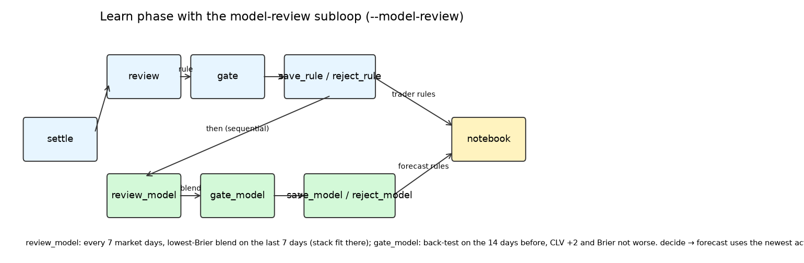
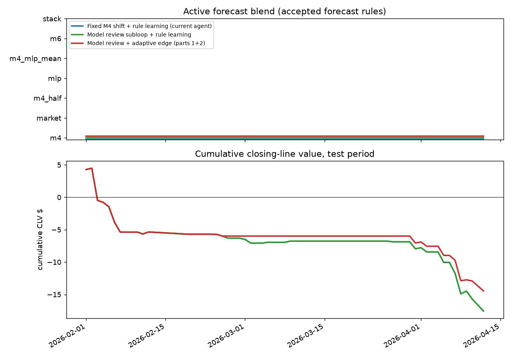

# Part 2: a model-review subloop that learns how to combine the models

**Question.** The agent trades on one forecast: the 24 h market anchor plus M4's news shift. Can a second learning subloop, reusing the notebook and the split gate, learn to use the other models (M4-NN MLP, M6 ImpactNet) and the market itself better?

**Design (pre-stated, fixed in code before the test period was run).**
- Components (as-of; every model trained before 1 Feb): anchor (home mid 24 h before tip), current home mid, M4 news shift, M4-NN MLP news shift (3 seeds, the validated config from `win_nn_eval`), M6 ImpactNet median move to tip. M1/M2 player projections are not added: M4's missing-minutes/points inputs already carry absent players' usual minutes and points. The official injury-report PDFs are future work (no as-of-safe parse in the time box).
- Candidate blends: anchor + 1.0·M4 shift (default), anchor only, anchor + 0.5·M4, anchor + MLP, anchor + mean(M4, MLP), current mid + M6 move, and a logistic stack (L2, C = 0.1) of [logit anchor, logit mid − logit anchor, M4, MLP, M6] fit on the selection days only.
- Review: every 7 market days once 21 market days from 1 Feb exist (so no window contains a game any model trained on), pick the lowest-Brier blend on the last 7 market days' decision points.
- Gate (pre-stated criterion): back-test the notebook with vs without the blend on the 14 market days before; accept only if CLV $ rises by ≥ $2 over ≥ 3 changed trades **and** the blend's Brier on those days' decision points is not worse than the forecasts actually used. Accepted blends are notebook rules of kind `forecast` (`forecast_blend`), valid from the decision time; a new one supersedes the old.
- Test period 2026-02-01–2026-04-12; day-clustered bootstrap (2000 reps, seed 7606).

## Trading results

| Setup | Trader rules accepted/proposed | Forecast rules accepted/proposed | Trades | Mean CLV/contract [95% CI] | CLV $ [95% CI] | P&L after fees [95% CI] |
| --- | --- | --- | --- | --- | --- | --- |
| Fixed M4 shift + rule learning (current agent) | 5/11 | 0/0 | 53 | -0.50¢ [-1.01, +0.19] | -18 [-34, -2] | -96 [-437, +247] |
| Model review subloop + rule learning | 5/11 | 0/6 | 53 | -0.50¢ [-1.01, +0.19] | -18 [-34, -2] | -96 [-437, +247] |
| Model review + adaptive edge (parts 1+2) | 5/10 | 0/6 | 42 | -0.45¢ [-1.07, +0.41] | -14 [-31, +1] | -102 [-359, +171] |

| Paired difference | Metric | Estimate [95% CI] | p (one-sided, a > b) |
| --- | --- | --- | --- |
| Model review subloop + rule learning − Fixed M4 shift + rule learning (current agent) | clv_dollars | +0 [+0, +0] | nan |
| Model review subloop + rule learning − Fixed M4 shift + rule learning (current agent) | pnl | +0 [+0, +0] | nan |
| Model review + adaptive edge (parts 1+2) − Fixed M4 shift + rule learning (current agent) | clv_dollars | +3 [+0, +6] | 0.037 |
| Model review + adaptive edge (parts 1+2) − Fixed M4 shift + rule learning (current agent) | pnl | -6 [-199, +198] | 0.533 |
| Model review + adaptive edge (parts 1+2) − Model review subloop + rule learning | clv_dollars | +3 [+0, +6] | 0.037 |
| Model review + adaptive edge (parts 1+2) − Model review subloop + rule learning | pnl | -6 [-199, +198] | 0.533 |

## Forecasts actually used vs the market

Brier difference CIs resample game-days. Lower is better; 'market at tip' is the closing line.

| Setup | Unit | Predictor | n | Brier | Log loss | Accuracy | Brier − market at decision [95% CI] | Brier − market at tip [95% CI] |
| --- | --- | --- | --- | --- | --- | --- | --- | --- |
| Fixed M4 shift + rule learning (current agent) | decision points | forecast used | 771 | 0.1636 | 0.4959 | 0.756 | +0.0030 [-0.0008, +0.0072] | +0.0036 [-0.0003, +0.0078] |
| Fixed M4 shift + rule learning (current agent) | decision points | market at decision | 771 | 0.1606 | 0.4872 | 0.756 |  |  |
| Fixed M4 shift + rule learning (current agent) | decision points | market at tip | 771 | 0.1600 | 0.4860 | 0.763 |  |  |
| Fixed M4 shift + rule learning (current agent) | games (last decision) | forecast used | 501 | 0.1663 | 0.5040 | 0.756 | +0.0026 [-0.0014, +0.0068] | +0.0031 [-0.0009, +0.0072] |
| Fixed M4 shift + rule learning (current agent) | games (last decision) | market at decision | 501 | 0.1638 | 0.4967 | 0.754 |  |  |
| Fixed M4 shift + rule learning (current agent) | games (last decision) | market at tip | 501 | 0.1633 | 0.4956 | 0.758 |  |  |
| Model review subloop + rule learning | decision points | forecast used | 771 | 0.1636 | 0.4959 | 0.756 | +0.0030 [-0.0008, +0.0072] | +0.0036 [-0.0003, +0.0078] |
| Model review subloop + rule learning | decision points | market at decision | 771 | 0.1606 | 0.4872 | 0.756 |  |  |
| Model review subloop + rule learning | decision points | market at tip | 771 | 0.1600 | 0.4860 | 0.763 |  |  |
| Model review subloop + rule learning | games (last decision) | forecast used | 501 | 0.1663 | 0.5040 | 0.756 | +0.0026 [-0.0014, +0.0068] | +0.0031 [-0.0009, +0.0072] |
| Model review subloop + rule learning | games (last decision) | market at decision | 501 | 0.1638 | 0.4967 | 0.754 |  |  |
| Model review subloop + rule learning | games (last decision) | market at tip | 501 | 0.1633 | 0.4956 | 0.758 |  |  |
| Model review + adaptive edge (parts 1+2) | decision points | forecast used | 771 | 0.1636 | 0.4959 | 0.756 | +0.0030 [-0.0008, +0.0072] | +0.0036 [-0.0003, +0.0078] |
| Model review + adaptive edge (parts 1+2) | decision points | market at decision | 771 | 0.1606 | 0.4872 | 0.756 |  |  |
| Model review + adaptive edge (parts 1+2) | decision points | market at tip | 771 | 0.1600 | 0.4860 | 0.763 |  |  |
| Model review + adaptive edge (parts 1+2) | games (last decision) | forecast used | 501 | 0.1663 | 0.5040 | 0.756 | +0.0026 [-0.0014, +0.0068] | +0.0031 [-0.0009, +0.0072] |
| Model review + adaptive edge (parts 1+2) | games (last decision) | market at decision | 501 | 0.1638 | 0.4967 | 0.754 |  |  |
| Model review + adaptive edge (parts 1+2) | games (last decision) | market at tip | 501 | 0.1633 | 0.4956 | 0.758 |  |  |

## Which blend was active when

**Model review subloop + rule learning** — active blend: m4 from 2026-02-01.

| Rule | Blend | Status | Decided | Superseded | Selection days (rows) | Selection Brier (best 3) | Gate days | CLV $ without → with | Brier used → blend (gate days) |
| --- | --- | --- | --- | --- | --- | --- | --- | --- | --- |
| f006 | stack | rejected | 2026-02-28 | – | 2026-02-21 – 2026-02-27 (76) | stack 0.1859, m6 0.1873, mlp 0.1881 | 2026-02-01 – 2026-02-20 | -5.70 → -18.24 | 0.2082 → 0.2094 |
| f008 | stack | rejected | 2026-03-07 | – | 2026-02-28 – 2026-03-06 (78) | stack 0.1434, m4_half 0.1499, market 0.1499 | 2026-02-08 – 2026-02-27 | -0.94 → -7.40 | 0.2002 → 0.1911 |
| f009 | stack | rejected | 2026-03-14 | – | 2026-03-07 – 2026-03-13 (79) | stack 0.1475, mlp 0.1477, m4_mlp_mean 0.1485 | 2026-02-21 – 2026-03-06 | -1.25 → -3.20 | 0.1702 → 0.2129 |
| f010 | m6 | rejected | 2026-03-21 | – | 2026-03-14 – 2026-03-20 (77) | m6 0.1527, m4 0.1538, m4_half 0.1544 | 2026-02-28 – 2026-03-13 | -0.45 → +0.00 | 0.1498 → 0.1522 |
| f011 | stack | rejected | 2026-04-04 | – | 2026-03-28 – 2026-04-03 (86) | stack 0.1352, market 0.1373, m4_half 0.1377 | 2026-03-14 – 2026-03-27 | -0.11 → -1.02 | 0.1476 → 0.1510 |
| f016 | m6 | rejected | 2026-04-11 | – | 2026-04-04 – 2026-04-10 (92) | m6 0.1222, stack 0.1228, mlp 0.1292 | 2026-03-21 – 2026-04-03 | -1.68 → +0.00 | 0.1400 → 0.1395 |

**Model review + adaptive edge (parts 1+2)** — active blend: m4 from 2026-02-01.

| Rule | Blend | Status | Decided | Superseded | Selection days (rows) | Selection Brier (best 3) | Gate days | CLV $ without → with | Brier used → blend (gate days) |
| --- | --- | --- | --- | --- | --- | --- | --- | --- | --- |
| f007 | stack | rejected | 2026-02-28 | – | 2026-02-21 – 2026-02-27 (76) | stack 0.1859, m6 0.1873, mlp 0.1881 | 2026-02-01 – 2026-02-20 | -5.70 → -18.24 | 0.2082 → 0.2094 |
| f008 | stack | rejected | 2026-03-07 | – | 2026-02-28 – 2026-03-06 (78) | stack 0.1434, m4_half 0.1499, market 0.1499 | 2026-02-08 – 2026-02-27 | -0.61 → -6.12 | 0.2002 → 0.1911 |
| f009 | stack | rejected | 2026-03-14 | – | 2026-03-07 – 2026-03-13 (79) | stack 0.1475, mlp 0.1477, m4_mlp_mean 0.1485 | 2026-02-21 – 2026-03-06 | -0.29 → -2.68 | 0.1702 → 0.2129 |
| f010 | m6 | rejected | 2026-03-21 | – | 2026-03-14 – 2026-03-20 (77) | m6 0.1527, m4 0.1538, m4_half 0.1544 | 2026-02-28 – 2026-03-13 | +0.00 → +0.00 | 0.1498 → 0.1522 |
| f012 | stack | rejected | 2026-04-04 | – | 2026-03-28 – 2026-04-03 (86) | stack 0.1352, market 0.1373, m4_half 0.1377 | 2026-03-14 – 2026-03-27 | +0.00 → +0.00 | 0.1476 → 0.1510 |
| f015 | m6 | rejected | 2026-04-11 | – | 2026-04-04 – 2026-04-10 (92) | m6 0.1222, stack 0.1228, mlp 0.1292 | 2026-03-21 – 2026-04-03 | -1.57 → +0.00 | 0.1400 → 0.1395 |

Every model review (selection-day Brier per candidate):

- review 2026-02-27: propose stack: Brier stack 0.1859, m6 0.1873, mlp 0.1881, m4_mlp_mean 0.1893, m4 0.1907, m4_half 0.1907, market 0.1912
- review 2026-03-06: propose stack: Brier stack 0.1434, m4_half 0.1499, market 0.1499, m4 0.1503, m4_mlp_mean 0.1512, mlp 0.1521, m6 0.1537
- review 2026-03-13: propose stack: Brier stack 0.1475, mlp 0.1477, m4_mlp_mean 0.1485, m4 0.1493, m6 0.1507, m4_half 0.1510, market 0.1530
- review 2026-03-20: propose m6: Brier m6 0.1527, m4 0.1538, m4_half 0.1544, m4_mlp_mean 0.1544, mlp 0.1552, market 0.1553, stack 0.1590
- review 2026-03-27: dropped m6: invalid or seen
- review 2026-04-03: propose stack: Brier stack 0.1352, market 0.1373, m4_half 0.1377, m4_mlp_mean 0.1382, mlp 0.1383, m4 0.1383, m6 0.1387
- review 2026-04-10: propose m6: Brier m6 0.1222, stack 0.1228, mlp 0.1292, m4_mlp_mean 0.1297, m4 0.1302, m4_half 0.1323, market 0.1347
- review_adapt 2026-02-27: propose stack: Brier stack 0.1859, m6 0.1873, mlp 0.1881, m4_mlp_mean 0.1893, m4 0.1907, m4_half 0.1907, market 0.1912
- review_adapt 2026-03-06: propose stack: Brier stack 0.1434, m4_half 0.1499, market 0.1499, m4 0.1503, m4_mlp_mean 0.1512, mlp 0.1521, m6 0.1537
- review_adapt 2026-03-13: propose stack: Brier stack 0.1475, mlp 0.1477, m4_mlp_mean 0.1485, m4 0.1493, m6 0.1507, m4_half 0.1510, market 0.1530
- review_adapt 2026-03-20: propose m6: Brier m6 0.1527, m4 0.1538, m4_half 0.1544, m4_mlp_mean 0.1544, mlp 0.1552, market 0.1553, stack 0.1590
- review_adapt 2026-03-27: dropped m6: invalid or seen
- review_adapt 2026-04-03: propose stack: Brier stack 0.1352, market 0.1373, m4_half 0.1377, m4_mlp_mean 0.1382, mlp 0.1383, m4 0.1383, m6 0.1387
- review_adapt 2026-04-10: propose m6: Brier m6 0.1222, stack 0.1228, mlp 0.1292, m4_mlp_mean 0.1297, m4 0.1302, m4_half 0.1323, market 0.1347

## Reading

**Verdict.** The model-review subloop proposed a different forecast six times (four logistic stacks, two M6), each the lowest-Brier blend on its 7 selection days, and the held-out CLV gate rejected all six. So the agent kept anchor + M4 shift all season, and in the full replay the arm is identical to the current agent: 53 trades, CLV $ −18 [−34, −2], P&L −96 [−437, +247]; paired difference +0 [+0, +0].
- **Why the stacks failed:** each one cost CLV on the gate days (e.g. −5.70 → −18.24, −0.94 → −7.40). The one stack that improved held-out Brier (0.2002 → 0.1911 on 8 Feb – 27 Feb) still lost CLV.
- **Why M6 failed:** both M6 proposals traded nothing on the gate days, so they could not gain the required $2.
- **With the adaptive edge added (parts 1+2):** 42 trades, CLV $ −14 [−31, +1], P&L −102 [−359, +171]. The +$3 [+0, +6] gain over the current agent comes entirely from the learned threshold.

**Reconciling with `forecast_blend.md`.** That evaluation reported +$18 [+4, +33] CLV, on a simplified one-decision-per-game trader with no notebook rules. Its blend is refit daily on up to 35 days of games and gated on held-out Brier. Here the stack is fit on about 80 decision points from 7 days and must raise CLV dollars inside the full agent, after the trader rules. Selection-day Brier picks it, but those wins do not carry over to earlier days' trading. The two results are consistent: the better probability shows up as small Brier/CLV gains in a clean comparison, but not reliably enough to pass a strict CLV gate inside the agent. The forecasts the agent used stayed slightly worse than the market at decision time (Brier +0.0030 [−0.0008, +0.0072]).

