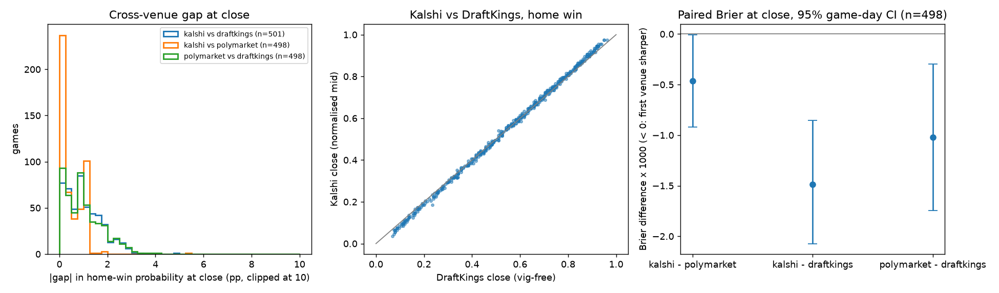

# Game-winner prices across venues (test period 2026-02-01 to 2026-04-12)

`python -m evaluation.venue_compare` · per-game data in `data/frozen/venue_prices.parquet` (git-ignored) ·
aggregates in `venue_compare.csv` · figure `venue_compare.png`.

## Sources

| Venue | Source | What we have |
|---|---|---|
| Kalshi | `KXNBAGAME` 1-minute candles (`data/frozen/prices.parquet`) | real top-of-book bid and ask, both team contracts |
| Polymarket | public CLOB `prices-history` (1-minute traded price), games looked up by slug `nba-<away>-<home>-<ET date>` | traded price only; ask = price + 0.01 (synthetic) |
| DraftKings | ESPN summary `pickcenter` (public, no key) | moneyline open and close only; no timestamps, so no tip - 24 h / tip - 1 h |

No other sportsbook, and no sharp book such as Pinnacle, is available from a free public no-key historical
source (ESPN's core odds API lists only DraftKings for these games and returns no line movement; historical
multi-book odds need a keyed API such as The Odds API, which we did not use).

Snapshots: last quote before tip - 24 h (max age 6 h), before tip - 1 h (max age 2 h) and before the
scheduled tip (close, max age 2 h). Fair home-win probability = mids normalised to sum to 1 (prediction
markets) or proportional vig removal (DraftKings). Fees: Kalshi taker 0.07·p·(1-p) per contract (unrounded;
real orders round up to the cent); Polymarket **current** sports taker fee 0.05·p·(1-p), makers free
(docs.polymarket.com/trading/fees, read 7 Oct 2026; we assume it applied in the test period, which may
overstate Polymarket's historical cost); DraftKings cost = 1 / decimal odds (vig inside the price).

## Coverage

501 regular-season games in the test period. Polymarket: 499 moneyline markets found,
499 matched to a game by team pair and date (±1 day).

| venue | close | open | t1h | t24h |
|---|---|---|---|---|
| draftkings | 501 | 501 | 0 | 0 |
| kalshi | 501 | 0 | 501 | 500 |
| polymarket | 498 | 0 | 498 | 498 |

Median Kalshi home-contract spread at close: 1.0c (mean 1.03c).
DraftKings overround at close: median 4.2%, mean 4.2%.

## Cross-venue gap in fair home-win probability (percentage points)

| time | pair | games | mean_pp | median_pp | p90_pp |
|---|---|---|---|---|---|
| t24h | kalshi vs polymarket | 497 | 0.55 | 0.50 | 1.01 |
| t1h | kalshi vs polymarket | 498 | 0.44 | 0.33 | 1.00 |
| close | kalshi vs polymarket | 498 | 0.43 | 0.29 | 1.00 |
| close | kalshi vs draftkings | 501 | 1.02 | 0.90 | 2.00 |
| close | polymarket vs draftkings | 498 | 1.00 | 0.85 | 2.11 |

## Best price after fees (who is cheapest for the side being bought)

Share of (game, side) pairs where each venue has the lowest all-in cost of a $1 payout, on games quoted by
every venue in the group; `mean_cost_over_best_c` is how much more than the cheapest venue it costs on average.

| time | venues | venue | n | share | mean_cost_over_best_c |
|---|---|---|---|---|---|
| close | kalshi / polymarket / draftkings | draftkings | 996 | 0.311 | 0.637 |
| close | kalshi / polymarket / draftkings | kalshi | 996 | 0.463 | 0.418 |
| close | kalshi / polymarket / draftkings | polymarket | 996 | 0.226 | 0.447 |
| close | kalshi / draftkings | draftkings | 1002 | 0.403 | 0.475 |
| close | kalshi / draftkings | kalshi | 1002 | 0.597 | 0.256 |
| t1h | kalshi / polymarket | kalshi | 996 | 0.716 | 0.237 |
| t1h | kalshi / polymarket | polymarket | 996 | 0.284 | 0.271 |
| t24h | kalshi / polymarket | kalshi | 994 | 0.413 | 0.579 |
| t24h | kalshi / polymarket | polymarket | 994 | 0.587 | 0.171 |

## Arbitrage check (buy home on one venue, away on another)

Edge = 1 - (all-in home cost + all-in away cost); > 0 means a locked-in profit per $1 payout before
settlement risk. Any cross-venue pair, per game:

| time | games | arb_games | median_edge_c | arb_share |
|---|---|---|---|---|
| t24h | 497 | 0 | nan | 0.000 |
| t1h | 498 | 0 | nan | 0.000 |
| close | 501 | 2 | 0.409 | 0.004 |

By combination:

| time | combo | games | arb_games | arb_share | median_edge_c | max_edge_c | median_cost_c |
|---|---|---|---|---|---|---|---|
| t24h | kalshi home + polymarket away | 497 | 0 | 0.000 | nan | -1.260 | 104.348 |
| t24h | polymarket home + kalshi away | 497 | 0 | 0.000 | nan | -1.362 | 104.409 |
| t1h | kalshi home + polymarket away | 498 | 0 | 0.000 | nan | -0.938 | 104.013 |
| t1h | polymarket home + kalshi away | 498 | 0 | 0.000 | nan | -1.199 | 103.938 |
| close | draftkings home + kalshi away | 501 | 0 | 0.000 | nan | -1.243 | 104.128 |
| close | draftkings home + polymarket away | 498 | 0 | 0.000 | nan | -1.214 | 104.176 |
| close | kalshi home + draftkings away | 501 | 1 | 0.002 | 0.125 | 0.125 | 103.988 |
| close | kalshi home + polymarket away | 498 | 0 | 0.000 | nan | -0.938 | 104.043 |
| close | polymarket home + draftkings away | 498 | 1 | 0.002 | 0.426 | 0.426 | 103.969 |
| close | polymarket home + kalshi away | 498 | 1 | 0.002 | 0.692 | 0.692 | 103.844 |

Caveats: Polymarket's ask is synthetic (traded price + 0.01), so its "arbs" are not executable
evidence: the real book may be wider, and a stale last trade can sit far from the live quote. DraftKings
lines have no timestamp and the "close" is ESPN's final pre-game line; real bet limits and line moves on
arrival matter. Settlement rules differ (Kalshi and Polymarket settle on the official result incl. overtime,
as does the sportsbook moneyline, but void/postponement rules differ). Latency, top-of-book size (often a few
hundred dollars on Kalshi), capital locked until settlement, and Polymarket USDC transfer costs are ignored.

## Which close is sharpest (vs actual outcomes)

Games quoted by every venue at close; 95% CIs from a game-day bootstrap (2000 reps).

| venue | metric | games | days | value | ci_low | ci_high |
|---|---|---|---|---|---|---|
| kalshi | brier | 498 | 64 | 0.1614 | 0.1469 | 0.1756 |
| kalshi | log_loss | 498 | 64 | 0.4909 | 0.4562 | 0.5250 |
| polymarket | brier | 498 | 64 | 0.1618 | 0.1474 | 0.1761 |
| polymarket | log_loss | 498 | 64 | 0.4922 | 0.4572 | 0.5260 |
| draftkings | brier | 498 | 64 | 0.1629 | 0.1489 | 0.1767 |
| draftkings | log_loss | 498 | 64 | 0.4963 | 0.4634 | 0.5290 |

Paired differences (negative = first venue sharper):

| pair | metric | value | ci_low | ci_high |
|---|---|---|---|---|
| kalshi - polymarket | brier | -0.0005 | -0.0009 | -0.0000 |
| kalshi - polymarket | log_loss | -0.0013 | -0.0026 | -0.0000 |
| kalshi - draftkings | brier | -0.0015 | -0.0021 | -0.0009 |
| kalshi - draftkings | log_loss | -0.0054 | -0.0072 | -0.0035 |
| polymarket - draftkings | brier | -0.0010 | -0.0017 | -0.0003 |
| polymarket - draftkings | log_loss | -0.0041 | -0.0063 | -0.0017 |

DraftKings open (vig-free) for reference: Brier 0.1676
on 501 games.
